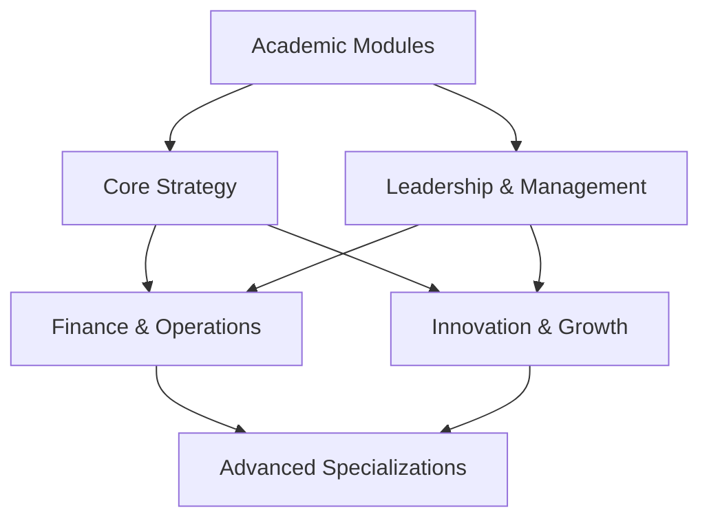

# 🗺️ Module Navigation Guide

Complete navigation system for MSL Strategic Management learning modules.

## Quick Module Access

### 🎯 By Learning Focus
- **Strategy Development** → [[Core Strategy]]
- **Leadership Skills** → [[Leadership & Management]]  
- **Financial Management** → [[Finance & Operations]]
- **Innovation & Growth** → [[Innovation & Growth]]
- **Academic Resources** → [[Academic Modules]]

### 📊 By Difficulty Level
- **Beginner** → [[Leadership & Management]], [[Innovation & Growth]]
- **Intermediate** → [[Core Strategy]], [[Finance & Operations]]
- **Advanced** → All modules with specialization tracks

### ⏱️ By Time Commitment
- **4-6 weeks** → [[Leadership & Management]]
- **6-8 weeks** → [[Innovation & Growth]]
- **8-10 weeks** → [[Core Strategy]], [[Finance & Operations]]
- **Flexible** → [[Academic Modules]]

## Learning Pathways

### 🚀 Executive Leadership Track
**For senior leaders and executives**
1. [[Leadership & Management]] (6 weeks)
2. [[Core Strategy]] (8 weeks)  
3. [[Innovation & Growth]] (8 weeks)
4. [[Finance & Operations]] (8 weeks)

**Total Duration:** 30 weeks
**Focus:** Comprehensive executive development

### 💼 Strategic Consultant Track  
**For strategy consultants and advisors**
1. [[Core Strategy]] (8 weeks)
2. [[Finance & Operations]] (8 weeks)
3. [[Innovation & Growth]] (6 weeks)
4. [[Leadership & Management]] (4 weeks)

**Total Duration:** 26 weeks
**Focus:** Consulting expertise and client advisory

### 🌟 Entrepreneur Track
**For entrepreneurs and business builders**
1. [[Innovation & Growth]] (8 weeks)
2. [[Finance & Operations]] (6 weeks)
3. [[Leadership & Management]] (6 weeks)
4. [[Core Strategy]] (6 weeks)

**Total Duration:** 26 weeks
**Focus:** Startup and growth company leadership

### 🎓 Academic Track
**For students and academic preparation**
1. [[Academic Modules]] (flexible)
2. [[Core Strategy]] (8 weeks)
3. [[Leadership & Management]] (6 weeks)
4. Specialization in chosen area

**Total Duration:** Variable
**Focus:** Academic foundation and research

## Module Progression Map

## Prerequisites Matrix

| Module | Prerequisites | Recommended Background |
|--------|---------------|------------------------|
| [[Academic Modules]] | None | Basic business knowledge |
| [[Leadership & Management]] | Basic management experience | Team leadership role |
| [[Core Strategy]] | Business strategy basics | Strategic planning exposure |
| [[Innovation & Growth]] | Basic business knowledge | Entrepreneurship interest |
| [[Finance & Operations]] | Finance/accounting basics | Financial analysis experience |

## Module Combinations

### 🔄 Parallel Learning (Advanced)
**For experienced professionals:**
- [[Core Strategy]] + [[Leadership & Management]]
- [[Finance & Operations]] + [[Innovation & Growth]]

### 📈 Sequential Learning (Recommended)
**For systematic skill building:**
- Foundation → Intermediate → Advanced
- Single module focus for depth

### 🎯 Focused Learning (Specialized)
**For specific development needs:**
- Single module with deep specialization
- Targeted skill development

## Assessment Integration

### Cross-Module Projects
- **Strategic Leadership Capstone:** Integrate all modules
- **Consulting Case Competition:** Apply multiple frameworks
- **Entrepreneurship Simulation:** End-to-end business building

### Portfolio Development
- **Leadership Portfolio:** Leadership & Management focus
- **Strategy Portfolio:** Core Strategy emphasis  
- **Innovation Portfolio:** Innovation & Growth centerpiece
- **Financial Portfolio:** Finance & Operations foundation

## Support Systems

### Module Coordinators
- **[[Core Strategy]]:** Strategy faculty lead
- **[[Leadership & Management]]:** Leadership development specialist
- **[[Finance & Operations]]:** Finance and operations expert
- **[[Innovation & Growth]]:** Entrepreneurship coordinator
- **[[Academic Modules]]:** Academic affairs coordinator

### Peer Learning Groups
- **Study circles** for each module
- **Cross-module integration** sessions
- **Alumni mentor** connections
- **Industry expert** guest sessions

### Digital Resources
- **Module dashboards** for progress tracking
- **Resource libraries** for each module
- **Discussion forums** for peer interaction
- **Virtual office hours** with coordinators

## Customization Options

### Individual Learning Plans
- **Self-paced progression** through modules
- **Competency-based advancement** rather than time-based
- **Personal interest** focus areas
- **Career goal** alignment

### Organizational Programs
- **Corporate cohorts** for team development
- **Leadership development** programs
- **Succession planning** preparation
- **Strategic planning** capability building

## Success Metrics

### Individual Progress
- **Module completion** rates and timelines
- **Assessment scores** and improvement trends
- **Skill development** evidence and application
- **Career advancement** outcomes

### Program Effectiveness
- **Learning outcome** achievement rates
- **Professional application** of skills
- **Career impact** measurement
- **Satisfaction scores** and feedback

## Getting Started

### 1. Assessment Phase
- [ ] Complete learning objectives assessment
- [ ] Identify career goals and interests  
- [ ] Evaluate current skill levels
- [ ] Choose appropriate learning pathway

### 2. Planning Phase
- [ ] Select modules and sequence
- [ ] Set timeline and milestones
- [ ] Identify support resources needed
- [ ] Create personal learning plan

### 3. Execution Phase
- [ ] Begin first module
- [ ] Engage with peer learning groups
- [ ] Complete assessments and exercises
- [ ] Apply learning in professional context

### 4. Integration Phase
- [ ] Connect learning across modules
- [ ] Complete capstone projects
- [ ] Develop professional portfolio
- [ ] Plan for continued development

## Quick Reference

### Emergency Module Selection
**Need strategic skills fast?** → [[Core Strategy]]
**New to leadership role?** → [[Leadership & Management]]
**Starting a business?** → [[Innovation & Growth]]
**Managing finances?** → [[Finance & Operations]]
**Academic preparation?** → [[Academic Modules]]

### Module Contact Information
- **General inquiries:** [coordinator-email]
- **Technical support:** [tech-support]
- **Academic advising:** [academic-advisor]
- **Career guidance:** [career-counselor]