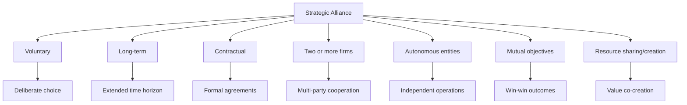
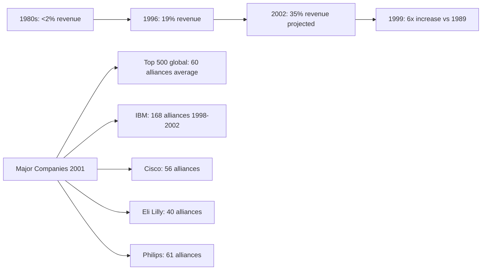
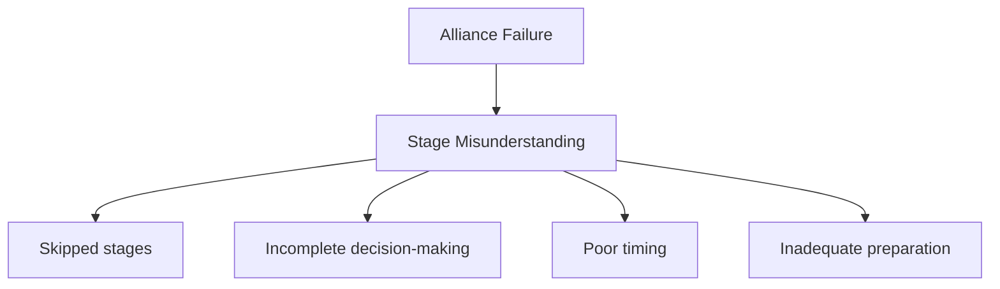
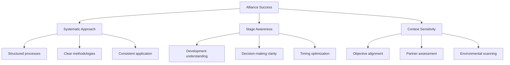
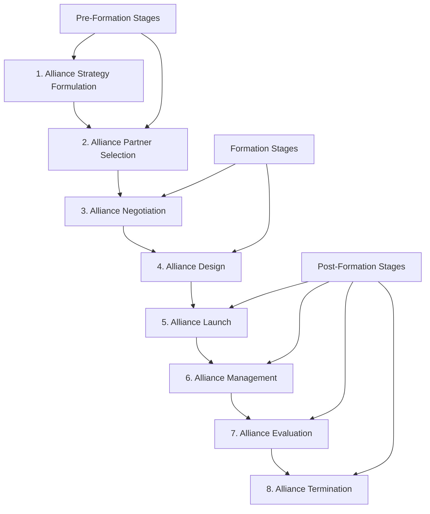
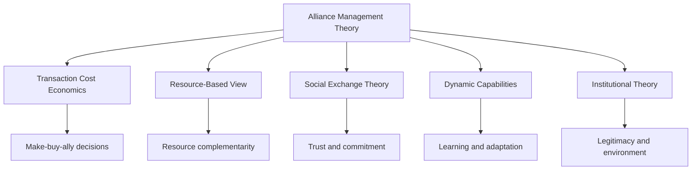

# Chapter 1: Strategic Alliance Management
## Foundational Concepts and Theoretical Framework

---

## Learning Objectives

By the end of this chapter, students will be able to:

1. **Define** strategic alliances using academically rigorous terminology
2. **Analyze** the exponential growth in alliance activity and its strategic implications
3. **Evaluate** the advantages and disadvantages of alliance strategies
4. **Synthesize** the causes of alliance failure and success factors
5. **Apply** the eight-stage alliance development framework
6. **Critically assess** alliance challenges and management requirements

---

## 1.1 The Meaning of an Alliance

### Academic Definition

> **Strategic Alliance**: A voluntary, long-term, contractual relationship between two or more autonomous and independent organizations (firms), designed to achieve mutual and individual objectives by sharing and/or creating resources.

*Source: Ariño et al. (2001, p. 110); Gulati (1995b)*

### Key Definitional Components

### Theoretical Implications

1. **Strategic Instrument**: Alliances serve as competitive advantage development tools
2. **Inter-organizational Cooperation**: Requires coordination between independent entities
3. **Mutual Dependency**: Creates interconnected value chains and shared risks
4. **Cooperative-Competitive Tension**: Simultaneous collaboration and competition ("coopetition")

### Alliance Scope and Boundaries

**Included Alliance Types**:
- Joint ventures
- Purchase partnerships
- R&D partnerships
- Co-makerships
- Co-creation efforts
- Multi-partner alliances
- Public-private partnerships
- Consortia

**Excluded Arrangements**:
- Simple market transactions
- Mergers and acquisitions
- Hierarchical relationships

---

## 1.2 Alliance Activity: Growth and Strategic Importance

### Empirical Evidence of Growth

### Strategic Drivers for Alliance Formation

#### 1. Resource Access and Complementarity
- **Capital Resources**: Financial capacity expansion
- **Technology Resources**: R&D capabilities and innovation
- **Knowledge Resources**: Specialized expertise and skills
- **Market Resources**: Distribution channels and customer access

#### 2. Operational Efficiency
- **Economies of Scale**: Volume expansion benefits
- **Risk Reduction**: Shared operational and strategic risks
- **Speed to Market**: Accelerated product/service launch
- **Cost Optimization**: Shared investments and expenses

#### 3. Strategic Positioning
- **Market Entry**: Geographic or segment expansion
- **Competitive Blocking**: Preventing competitor advantages
- **Learning Opportunities**: Knowledge acquisition and exchange
- **Legitimacy Effects**: Reputation and credibility enhancement

#### 4. Growth and Innovation
- **Internal Growth Acceleration**: Enhanced organic growth rates
- **Innovation Capacity**: Combined R&D and creative capabilities
- **Flexibility**: Adaptive responses to market changes
- **Assessment Tool**: Evaluation of potential acquisition targets

### Advantages vs. Disadvantages Analysis

| **Advantages** | **Disadvantages** |
|----------------|-------------------|
| Resource access and complementarity | Loss of proprietary information |
| Risk sharing and reduction | Managerial complexity and coordination costs |
| Economies of scale and scope | Opportunistic behavior risks |
| Speed to market enhancement | Relationship lock-in effects |
| Learning and knowledge exchange | Decision autonomy loss |
| Competitive positioning | Organizational flexibility reduction |
| Legitimacy and reputation effects | Regulatory constraints |
| Flexibility vs. hierarchies/markets | Learning barriers and absorptive capacity |
| Assessment of acquisition partners | Unforeseen contingencies |

---

## 1.3 Alliance Failure: Causes and Implications

### Failure Rate Analysis

**Empirical Evidence**:
- High-tech alliances: 60% failure rate (Duysters et al., 1999)
- General alliance population: 50-70% failure rate (various studies)
- International alliances: Higher failure rates due to complexity

### Root Causes of Alliance Failure

#### 1. Lack of Development Stage Understanding

#### 2. Context-Specific Challenge Ignorance
- **Objective Misalignment**: Different alliance purposes require different approaches
- **Partner Characteristic Neglect**: Size, culture, industry differences
- **Environmental Factor Dismissal**: Regulatory, competitive, technological contexts

#### 3. Systematic Approach Absence
- **Ad-hoc Decision Making**: Reactive rather than proactive management
- **Process Inconsistency**: Lack of standardized alliance management
- **Knowledge Deficiency**: Insufficient understanding of alliance dynamics

### Success Factor Framework

---

## 1.4 Alliance Development Framework

### Eight-Stage Development Model

### Stage-Specific Decision-Making Requirements

#### Stage 1: Alliance Strategy Formulation
**Objective**: Determine optimal governance mode (make, buy, or ally)
**Key Decisions**:
- Business strategy alignment
- Resource requirement assessment
- Governance mode evaluation
- Alliance strategy development

#### Stage 2: Alliance Partner Selection
**Objective**: Identify and select appropriate alliance partners
**Key Decisions**:
- Partner fit assessment
- Capability evaluation
- Cultural compatibility analysis
- Selection criteria application

#### Stage 3: Alliance Negotiation
**Objective**: Establish mutually beneficial agreement terms
**Key Decisions**:
- Valuation methodologies
- Negotiation strategies
- Contract terms definition
- Risk allocation agreements

#### Stage 4: Alliance Design
**Objective**: Create structural and governance frameworks
**Key Decisions**:
- Governance form selection
- Contract specification
- Management control systems
- Structural configuration

#### Stage 5: Alliance Launch
**Objective**: Implement alliance operations effectively
**Key Decisions**:
- Launch planning
- Integration processes
- Communication systems
- Initial performance metrics

#### Stage 6: Alliance Management
**Objective**: Optimize ongoing alliance performance
**Key Decisions**:
- Management approach selection
- Coordination mechanisms
- Conflict resolution processes
- Relationship maintenance

#### Stage 7: Alliance Evaluation
**Objective**: Assess alliance performance and value creation
**Key Decisions**:
- Performance metric definition
- Evaluation methodologies
- Success measurement
- Improvement identification

#### Stage 8: Alliance Termination
**Objective**: Manage alliance conclusion effectively
**Key Decisions**:
- Termination planning
- Asset transfer processes
- Relationship closure
- Learning capture

---

## 1.5 Alliance Challenges and Theoretical Perspectives

### Challenge Categories

#### 1. Alliance Attributes
- **Governance Form Complexity**: Equity vs. non-equity structures
- **Contract Specification**: Formal vs. relational governance
- **Control Mechanisms**: Output vs. process vs. social control

#### 2. Alliance Competences
- **Professional Development**: Alliance manager capabilities
- **Team Effectiveness**: Cross-organizational collaboration
- **Organizational Capabilities**: Alliance management systems

#### 3. Alliance Mindset and System Perspective
- **Tension Management**: Cooperative-competitive balance
- **Co-evolutionary Thinking**: System-level alliance understanding
- **Contemporary Adaptation**: Technology, sustainability, societal impact

### Theoretical Integration Framework

---

## 1.6 Critical Analysis and Contemporary Relevance

### Academic Contribution

This foundational chapter establishes strategic alliance management as a **distinct academic discipline** requiring:

1. **Theoretical Rigor**: Integration of multiple theoretical perspectives
2. **Empirical Grounding**: Evidence-based management guidelines
3. **Practical Relevance**: Real-world application frameworks
4. **Systematic Approach**: Structured development methodologies

### Contemporary Strategic Implications

#### Digital Transformation Impact
- **Platform Alliances**: Ecosystem-based value creation
- **Data Partnerships**: Information sharing and analytics
- **Technology Integration**: API-based collaborations

#### Sustainability and ESG
- **Environmental Partnerships**: Climate change mitigation
- **Social Impact Alliances**: Community development
- **Governance Collaborations**: Ethical business practices

#### Globalization and Complexity
- **Cross-Cultural Management**: Cultural intelligence requirements
- **Regulatory Compliance**: Multi-jurisdictional considerations
- **Supply Chain Resilience**: Risk management partnerships

---

## Discussion Questions

### Critical Thinking Prompts

1. **Theoretical Integration**: How do different theoretical perspectives (TCE, RBV, SET) complement or conflict in alliance strategy formulation?

2. **Failure Analysis**: Given the high failure rates, should organizations be more conservative in alliance formation, or does the potential value justify the risks?

3. **Digital Disruption**: How has digital transformation changed the fundamental nature of alliance relationships and management requirements?

4. **Measurement Paradox**: If alliance success is difficult to measure, how can organizations justify continued investment in alliance strategies?

5. **Cultural Evolution**: How should alliance management practices evolve to address increasing cultural diversity and global complexity?

### Application Exercises

1. **Case Analysis**: Examine a recent high-profile alliance failure and identify which of the eight development stages contributed to the failure.

2. **Industry Comparison**: Compare alliance strategies across different industries (technology, pharmaceuticals, automotive) and explain variations.

3. **Future Scenarios**: Predict how emerging technologies (AI, blockchain, IoT) will transform alliance management practices.

---

## Key Takeaways

### Academic Insights
- Strategic alliances require **systematic, theory-informed management approaches**
- **Multi-theoretical integration** provides comprehensive understanding
- **Empirical evidence** supports the need for structured development frameworks

### Practical Implications
- **Failure prevention** through systematic stage management
- **Success enhancement** via evidence-based decision-making
- **Competitive advantage** through superior alliance capabilities

### Future Directions
- **Digital alliance models** requiring new management approaches
- **Sustainability integration** as strategic imperative
- **Cultural competence** as core alliance capability

---

**Next Chapter Preview**: Chapter 2 will examine alliance strategy formulation, focusing on governance mode decisions and the theoretical frameworks guiding make-buy-ally choices.

---

## References and Further Reading

### Primary Sources
- Ariño, A., de la Torre, J., & Ring, P. S. (2001). Relational quality: Managing trust in corporate alliances
- Gulati, R. (1995b). Does familiarity breed trust? The implications of repeated ties for contractual choice in alliances
- Barringer, B. R., & Harrison, J. S. (2000). Walking a tightrope: Creating value through interorganizational relationships

### Contemporary Applications
- Digital platform alliance strategies
- Sustainability partnership frameworks
- Cross-cultural alliance management best practices

### Academic Journals
- Strategic Management Journal
- Journal of Management Studies
- Organization Science
- Academy of Management Review