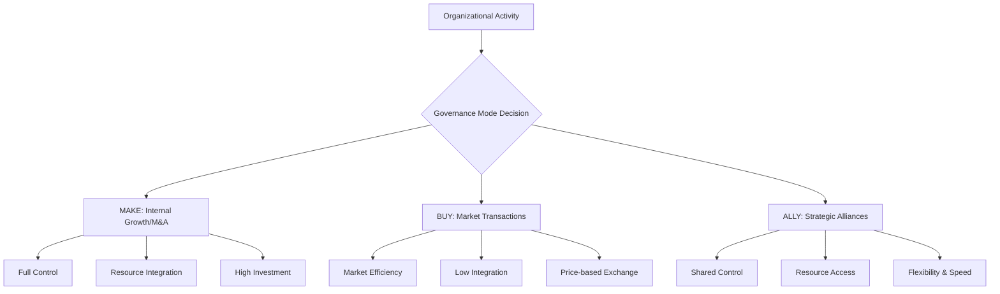
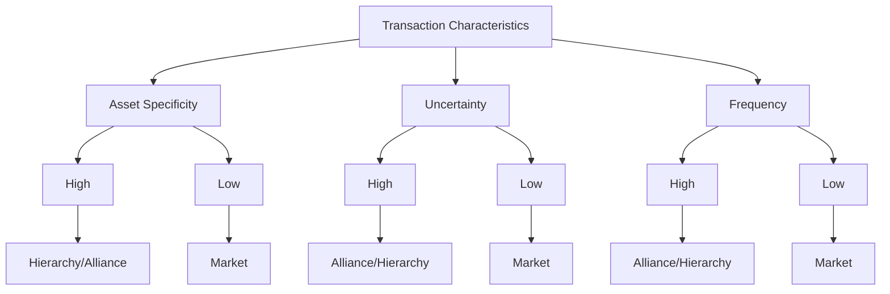
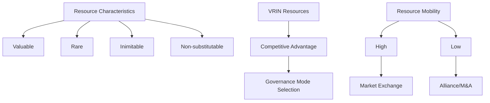
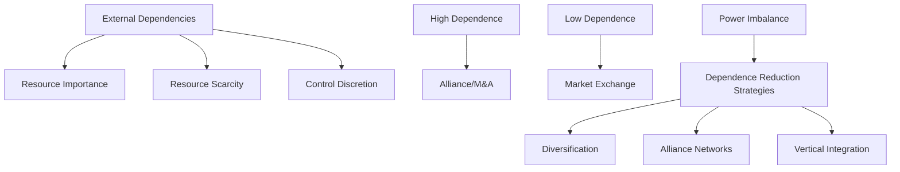
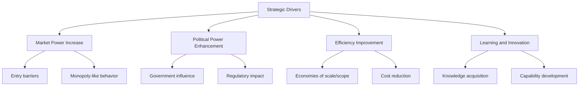
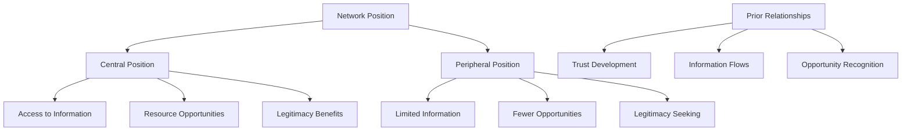
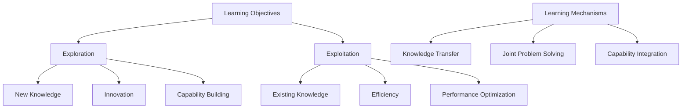
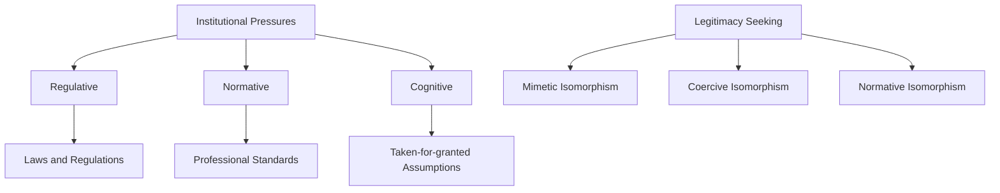
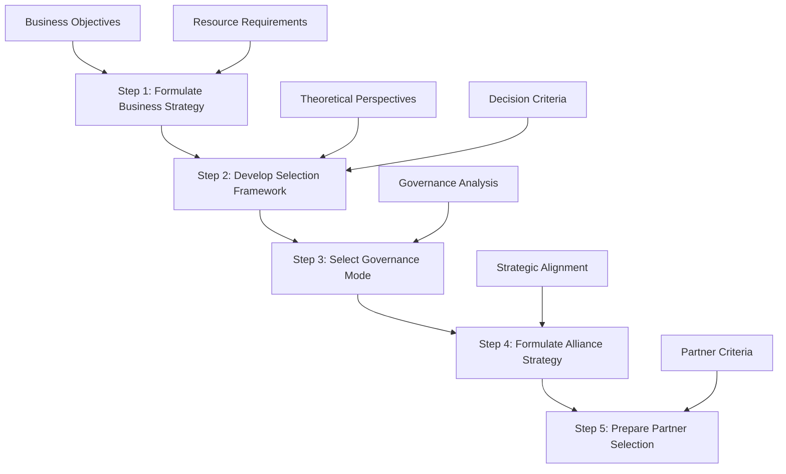
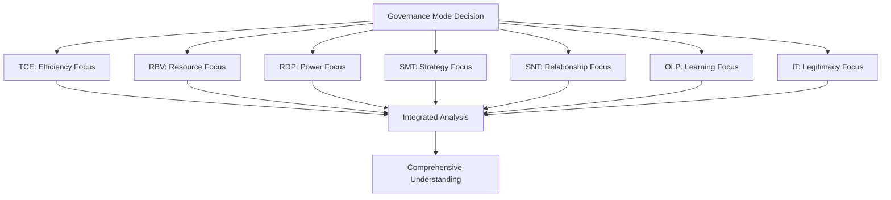

# Chapter 2: Alliance Strategy Formulation
## Governance Mode Decisions and Theoretical Foundations

---

## Learning Objectives

By the end of this chapter, students will be able to:

1. **Distinguish** between the three prototypical governance modes (make, buy, ally)
2. **Analyze** seven theoretical perspectives guiding governance mode decisions
3. **Evaluate** the strategic rationales for alliance formation
4. **Apply** the five-step alliance strategy formulation framework
5. **Synthesize** multi-theoretical insights for governance mode selection
6. **Critically assess** the advantages and limitations of each theoretical perspective

---

## 2.1 Three Prototypical Governance Modes

### Conceptual Framework

The fundamental question facing organizations is: **How should we organize our activities to achieve our objectives?**

### Make Governance Mode

#### Definition and Characteristics
**Make** = Internal procurement through autonomous investment or mergers & acquisitions

**Key Features**:
- **Property Rights**: Full ownership and control
- **Resource Integration**: Complete internalization of capabilities
- **Competitive Advantage**: Development "out of sight" of competitors
- **Control**: Maximum over margins and markets

#### Advantages and Disadvantages

| **Advantages** | **Disadvantages** |
|----------------|-------------------|
| Complete control over activities | Increased bureaucracy |
| Proprietary competitive advantage | Reduced flexibility |
| Market and margin control | High investment requirements |
| Resource integration synergies | Difficult cost recovery if failure |
| Strategic autonomy | Internal capability limitations |

#### When to Choose "Make"
- **High asset specificity** required
- **Critical strategic importance** of activity
- **Existing internal capabilities** available
- **Long-term competitive advantage** needed
- **Control over intellectual property** essential

### Buy Governance Mode

#### Definition and Characteristics
**Buy** = Market-based procurement through discrete transactions

**Key Features**:
- **Price Mechanism**: Supply and demand governs exchange
- **Low Integration**: Minimal organizational coupling
- **Information Efficiency**: Market processes information effectively
- **Flexibility**: Easy supplier switching

#### Advantages and Disadvantages

| **Advantages** | **Disadvantages** |
|----------------|-------------------|
| Access to market information | Opposing objectives (cost vs. revenue) |
| Supplier competition benefits | Potential opportunistic behavior |
| Low organizational integration | Information asymmetries |
| Cost efficiency | Supplier market power |
| Operational flexibility | Market failure risks |

#### When to Choose "Buy"
- **Commodity-like resources** needed
- **Well-functioning markets** exist
- **Low asset specificity** requirements
- **Short-term needs** only
- **Multiple suppliers** available

### Ally Governance Mode

#### Definition and Characteristics
**Ally** = Collaborative arrangements with external parties for resource access

**Key Features**:
- **Hybrid Governance**: Between hierarchy and market
- **Shared Resources**: Access without ownership
- **Flexibility**: Speed in resource exploitation
- **Risk Sharing**: Distributed investments and uncertainties

#### Advantages and Disadvantages

| **Advantages** | **Disadvantages** |
|----------------|-------------------|
| Complementary resource access | Lack of full control |
| Speed and flexibility | Coordination complexity |
| Risk and investment sharing | Partner dependency |
| Learning opportunities | Information leakage risks |
| Market entry facilitation | Performance monitoring challenges |

#### When to Choose "Ally"
- **Complementary resources** needed
- **High uncertainty** environments
- **Speed to market** critical
- **Learning objectives** important
- **Risk sharing** beneficial

---

## 2.2 Governance Mode Rationales: Seven Theoretical Perspectives

### 2.2.1 Transaction Cost Economics (TCE)

#### Core Logic
**Premise**: Organizations choose governance modes that minimize transaction costs

#### Key Assumptions
1. **Opportunism**: Self-interested, deceptive behavior potential
2. **Bounded Rationality**: Limited cognitive capacity for complex planning

#### Exchange Conditions
- **Asset Specificity**: Relationship-specific investments
- **Uncertainty**: Unpredictable consequences
- **Frequency**: Number of repeated exchanges

#### Alliance Implications
- **Moderate Asset Specificity**: Alliances preferred over pure market/hierarchy
- **Relational Governance**: Trust reduces transaction costs
- **Safeguarding Mechanisms**: Contracts and monitoring systems

#### Empirical Evidence and Limitations
**Supporting Evidence**:
- Alliance design aligned with TCE predictions improves performance
- Asset specificity influences governance mode selection

**Limitations**:
- Limited empirical support for complete TCE predictions
- Underestimates role of trust and relational governance
- Static perspective on governance evolution

### 2.2.2 Resource-Based View (RBV)

#### Core Logic
**Premise**: Firms seek optimal resource boundaries to maximize competitive advantage

#### Alliance Formation Logic
1. **Resource Complementarity**: Accessing external capabilities
2. **Resource Leverage**: Combining resources for synergy
3. **Resource Learning**: Acquiring new capabilities
4. **Resource Preservation**: Maintaining competitive advantage

#### Resource Configurations
- **Complementary Alignment**: Dissimilar but synergistic resources
- **Supplementary Alignment**: Similar resources for scale/scope
- **Resource Under-performance**: Misaligned or ineffective combinations

#### Limitations
- **Limited empirical testing** of resource impact on governance
- **Cost neglect**: Focus on possession vs. deployment costs
- **Static perspective**: Insufficient attention to resource evolution

### 2.2.3 Resource Dependence Perspective (RDP)

#### Core Logic
**Premise**: Firms manage external dependencies through governance mode selection

#### Power and Dependence Dynamics
- **Resource Importance**: Criticality for firm survival
- **Resource Scarcity**: Availability and substitutability
- **Discretion**: Control over resource allocation and use

#### Alliance Implications
- **Mutual Dependence**: Balanced power relationships
- **Resource Exchange**: Complementary dependencies
- **Network Effects**: Multiple relationship management

#### Limitations
- **Limited empirical evidence** for governance mode predictions
- **Neglect of relationship history** and social connections
- **Information availability assumptions** unrealistic

### 2.2.4 Strategic Management Theory (SMT)

#### Core Logic
**Premise**: Governance modes serve strategic objectives and competitive positioning

#### Strategic Drivers for Alliances

#### Internal vs. External Strategic Motives

**Internal Motives**:
1. **Market Power**: Entry barriers and competitive positioning
2. **Political Power**: Regulatory and government influence
3. **Efficiency**: Cost reduction and scale economies
4. **Learning**: Knowledge and capability acquisition

**External Motives**:
1. **Globalization**: International market access
2. **Technological Change**: Innovation requirements
3. **Regulatory Changes**: Compliance and adaptation
4. **Industry Restructuring**: Competitive dynamics

#### Limitations
- **Broad applicability**: Logic applies to all governance modes
- **Lack of specificity**: Limited guidance for mode selection
- **Overlap with other theories**: Concepts explained by multiple perspectives

### 2.2.5 Social Network Theory (SNT)

#### Core Logic
**Premise**: Prior relationships and network position influence alliance formation

#### Network Implications
- **Structural Holes**: Bridging disconnected network segments
- **Network Centrality**: Access to information and opportunities
- **Relationship Quality**: Trust and information exchange
- **Learning Networks**: Knowledge sharing and innovation

#### Alliance Formation Factors
1. **Prior Alliance Experience**: Learning and capability development
2. **Network Position**: Information access and opportunity recognition
3. **Relationship Quality**: Trust and collaboration effectiveness
4. **Structural Configuration**: Network density and connectivity

### 2.2.6 Organizational Learning Perspective (OLP)

#### Core Logic
**Premise**: Alliances serve as vehicles for knowledge acquisition and capability development

#### Learning Alliance Types
- **Exploration Alliances**: New knowledge and innovation focus
- **Exploitation Alliances**: Existing knowledge optimization
- **Ambidextrous Alliances**: Both exploration and exploitation

#### Learning Challenges
1. **Absorptive Capacity**: Ability to recognize and assimilate knowledge
2. **Knowledge Tacitness**: Difficulty in transferring implicit knowledge
3. **Learning Race**: Competitive knowledge acquisition
4. **Knowledge Protection**: Preventing unwanted spillovers

### 2.2.7 Institutional Theory (IT)

#### Core Logic
**Premise**: Institutional pressures and legitimacy concerns drive governance decisions

#### Institutional Isomorphism
1. **Mimetic**: Copying successful organization practices
2. **Coercive**: Compliance with regulatory requirements
3. **Normative**: Professional standards and best practices

#### Alliance Implications
- **Legitimacy Enhancement**: External validation and credibility
- **Risk Reduction**: Proven practices and industry norms
- **Access to Resources**: Institutional network connections
- **Regulatory Compliance**: Meeting legal and industry requirements

---

## 2.3 Alliance Strategy Formulation: Decision-Making Framework

### Five-Step Decision Process

### Step 1: Formulate Business Strategy

#### Objectives
- **Strategy Clarification**: Corporate and business-level strategic direction
- **Activity Overview**: Current and required new activities
- **Resource Assessment**: Existing and needed resources

#### Key Questions
1. What are our strategic objectives and competitive positioning goals?
2. Which activities are critical for achieving these objectives?
3. What resources do we currently possess and what do we need?
4. How do these activities align with our core competencies?

### Step 2: Develop Selection Framework

#### Objectives
- **Criteria Definition**: Establish governance mode decision criteria
- **Theoretical Integration**: Apply relevant theoretical perspectives
- **Framework Construction**: Create systematic evaluation approach

#### Decision Criteria Categories
1. **Transaction-based**: Asset specificity, uncertainty, frequency (TCE)
2. **Resource-based**: Resource complementarity, value creation potential (RBV)
3. **Dependence-based**: Resource importance, scarcity, control (RDP)
4. **Strategic**: Market power, efficiency, learning objectives (SMT)
5. **Network-based**: Relationship history, network position (SNT)
6. **Learning-based**: Knowledge acquisition, capability development (OLP)
7. **Institutional**: Legitimacy, regulatory compliance (IT)

### Step 3: Select Governance Mode

#### Analysis Framework

| Criteria | Make | Buy | Ally |
|----------|------|-----|------|
| Asset Specificity | High | Low | Medium |
| Uncertainty | Medium | Low | High |
| Resource Complementarity | Low | Low | High |
| Learning Objectives | Medium | Low | High |
| Speed Requirements | Low | High | High |
| Control Needs | High | Low | Medium |
| Investment Capacity | High | Low | Medium |
| Risk Tolerance | Low | Medium | High |

#### Decision Logic
- **High Asset Specificity + Control Needs** → **Make**
- **Commodity Resources + Cost Focus** → **Buy**
- **Complementary Resources + Speed** → **Ally**

### Step 4: Formulate Alliance Strategy

#### If "Ally" is Selected
1. **Alliance Objectives**: Specify desired outcomes and success metrics
2. **Resource Contributions**: Define what each partner will provide
3. **Value Creation Logic**: Articulate how alliance creates value
4. **Success Metrics**: Establish performance measurement criteria

#### Strategic Components
- **Value Proposition**: Clear articulation of alliance benefits
- **Resource Configuration**: Optimal combination of partner resources
- **Governance Structure**: Initial thoughts on alliance design
- **Risk Management**: Identification and mitigation strategies

### Step 5: Prepare Partner Selection

#### Transition to Partner Selection
- **Partner Criteria**: Develop selection and evaluation criteria
- **Search Strategy**: Plan approach for identifying potential partners
- **Evaluation Framework**: Create systematic partner assessment process
- **Negotiation Preparation**: Initial preparation for alliance negotiations

---

## 2.4 Multi-Theoretical Integration Framework

### Theoretical Synthesis

### Complementary Perspectives

#### Transaction Costs + Resource Value
- **Cost-Benefit Analysis**: TCE efficiency + RBV value creation
- **Resource Specificity**: Asset specificity + resource complementarity
- **Risk-Return Trade-offs**: Transaction costs vs. resource benefits

#### Power + Networks
- **Relationship Management**: RDP power dynamics + SNT network position
- **Dependency Reduction**: Resource dependencies + network diversification
- **Information Access**: Power sources + network information flows

#### Strategy + Learning
- **Dynamic Capabilities**: SMT strategic positioning + OLP capability development
- **Competitive Advantage**: Strategic motives + learning outcomes
- **Innovation Focus**: Strategic innovation + organizational learning

### Integration Challenges

1. **Theoretical Conflicts**: Different predictions from competing theories
2. **Empirical Complexity**: Multiple variables and interactions
3. **Managerial Complexity**: Balancing multiple considerations
4. **Dynamic Evolution**: Changing conditions over time

---

## 2.5 Contemporary Applications and Case Analysis

### Case Study: Google-HubSpot Alliance

#### Background
- **Google**: Global technology platform and advertising giant
- **HubSpot**: Marketing automation and CRM software provider
- **Alliance Type**: Strategic technology partnership

#### Governance Mode Analysis

**Why Not "Make"?**
- High development costs and time requirements
- Different core competencies (search/ads vs. marketing automation)
- Risk of diverting resources from core business

**Why Not "Buy"?**
- Complex integration requirements
- Need for ongoing collaboration and innovation
- Market not suitable for simple transactions

**Why "Ally"?**
- Complementary resource needs
- Shared learning and innovation objectives
- Speed to market requirements
- Risk sharing for new market development

#### Theoretical Perspectives Applied

**TCE Analysis**:
- Moderate asset specificity (integration investments)
- High uncertainty (evolving market needs)
- Frequent interactions (ongoing collaboration)
→ **Alliance governance preferred**

**RBV Analysis**:
- Complementary resources (Google's platform + HubSpot's CRM)
- Value creation through integration
- Preserved competitive advantages
→ **Alliance enables resource synergy**

**Strategic Analysis**:
- Market expansion objectives
- Competitive positioning enhancement
- Learning and innovation focus
→ **Alliance supports strategic goals**

---

## Discussion Questions

### Critical Analysis

1. **Theoretical Integration**: How can managers effectively integrate insights from multiple theoretical perspectives when making governance mode decisions?

2. **Dynamic Considerations**: How should governance mode decisions adapt as alliance relationships evolve and circumstances change?

3. **Industry Variations**: To what extent do industry characteristics influence the applicability of different theoretical perspectives?

4. **Cultural Context**: How do national and organizational cultures affect governance mode decision-making processes?

5. **Digital Transformation**: How has digital technology changed the relative attractiveness of different governance modes?

### Application Exercises

1. **Case Analysis**: Apply the five-step framework to analyze a recent alliance announcement in your industry of interest.

2. **Theoretical Comparison**: Compare TCE and RBV predictions for a specific governance mode decision and explain any differences.

3. **Strategic Scenario**: Design an alliance strategy for a hypothetical company facing specific strategic challenges.

---

## Key Takeaways

### Academic Insights
- **Multi-theoretical approach** provides comprehensive understanding
- **Governance mode decisions** require systematic analysis of multiple factors
- **No single theory** perfectly explains all alliance decisions
- **Theoretical integration** enhances decision-making quality

### Practical Implications
- **Systematic framework** improves governance mode decisions
- **Multiple perspectives** reveal different aspects of alliance value
- **Strategic alignment** essential for alliance success
- **Context-specific analysis** required for optimal decisions

### Future Directions
- **Dynamic governance models** for evolving relationships
- **Digital platform alliances** requiring new theoretical insights
- **Ecosystem thinking** beyond dyadic alliance relationships
- **Sustainability integration** as governance consideration

---

**Next Chapter Preview**: Chapter 3 will examine alliance partner selection, focusing on partner fit assessment and systematic selection processes.

---

## References and Further Reading

### Theoretical Foundations
- Williamson, O. E. (1991). Comparative economic organization
- Barney, J. (1991). Firm resources and sustained competitive advantage
- Pfeffer, J., & Salancik, G. R. (1978). The external control of organizations

### Contemporary Applications
- Digital platform governance strategies
- Ecosystem alliance management
- Cross-sector partnership models
- Sustainability-focused alliance strategies