# Case Study Analysis: Areva-Siemens Nuclear Alliance Divorce
## Co-Evolution Failure and Termination Challenges

---

## Case Background Summary

**Alliance Formation (2001)**:
- **Partners**: Siemens (German conglomerate) & Areva (French nuclear specialist)
- **Structure**: Joint venture "Areva NP" (34% Siemens, 66% Areva)
- **Context**: German nuclear phase-out policy, Siemens strategic refocus
- **Buyout Option**: Areva held right to purchase Siemens' stake

**Alliance Evolution (2001-2009)**:
- **Market Success**: Areva NP became industry leader
- **Market Revival**: Nuclear renaissance driven by oil prices and climate concerns
- **Strategic Divergence**: Siemens wanted greater control and value chain integration
- **Political Constraints**: French government opposition to increased German control

**Alliance Termination (2009-2012)**:
- **Withdrawal**: Siemens announced exit via email to pursue Rosatom partnership
- **Complications**: €4 billion buyout, 8-year non-compete clause, software dependencies
- **Legal Battle**: European Commission intervention, contract disputes
- **Resolution**: 3-year non-compete clause, Areva acquired full control

---

## **Question 1: Why did co-evolution fail in the relationship between Areva and Siemens?**

### **Theoretical Framework: Alliance Co-Evolution Analysis**

Using our **Alliance System Perspective (Chapter 25)**, co-evolution failure occurs when partners, alliance, and environment evolve in incompatible directions, creating irreconcilable tensions.

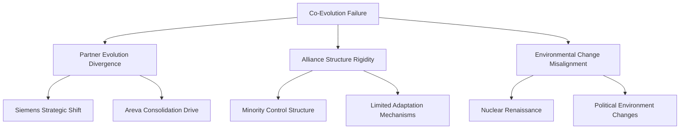

### **1. Partner Evolution Divergence**

#### **Siemens Strategic Evolution**

**Initial Position (2001)**:
- **Divesting Focus**: Nuclear not core to strategy
- **German Context**: Government nuclear phase-out
- **Portfolio Optimization**: Reducing nuclear exposure

**Evolved Position (2009)**:
- **Strategic Reversal**: Nuclear seen as growth opportunity
- **Market Opportunity**: Nuclear renaissance recognition
- **Value Chain Ambition**: Full integration desire beyond reactors
- **Control Requirements**: Need for strategic autonomy

**Strategic Shift Analysis**:
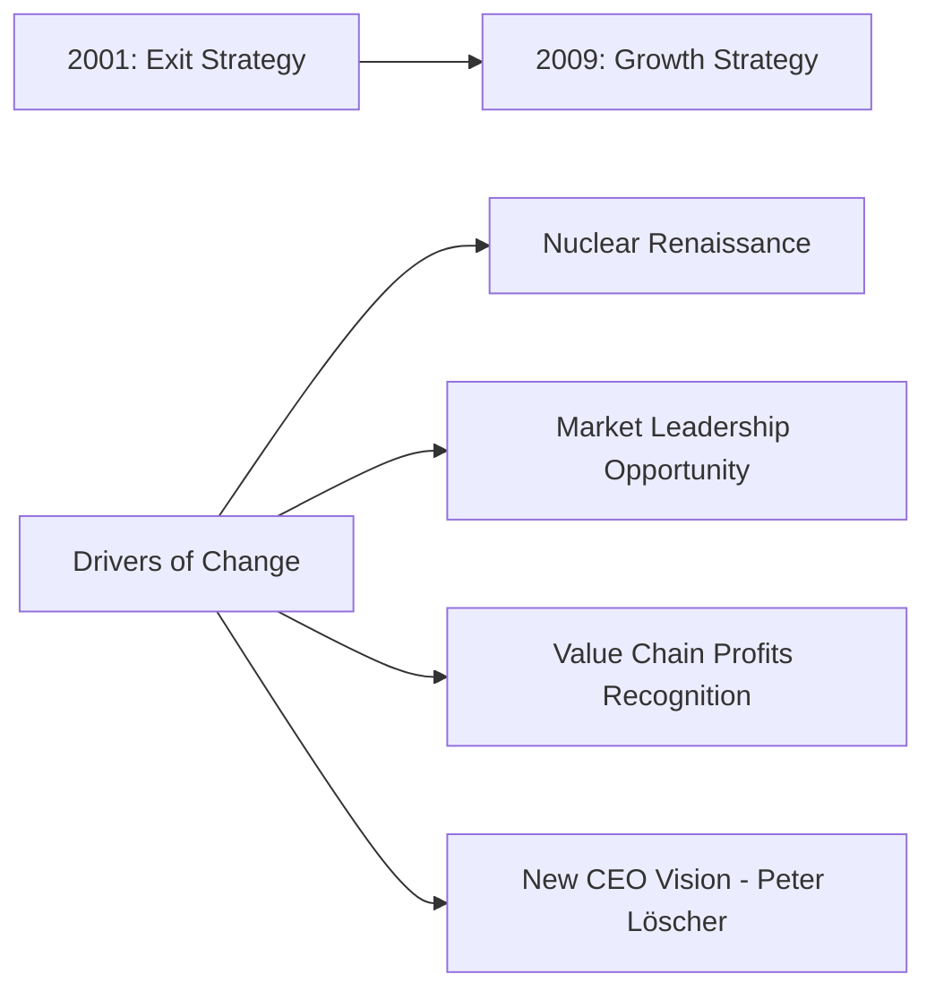

#### **Areva Strategic Evolution**

**Consistent Position**:
- **Core Business**: Nuclear remains central strategy
- **Market Leadership**: Dominant position maintenance
- **French Champion**: National strategic asset role
- **Full Control Preference**: Minimize external influence

**Areva's Perspective on Success**:
- Joint venture achieved market leadership
- Successful collaboration validated initial strategy
- No need for fundamental structural changes

### **2. Alliance Structure Inadequacy**

#### **Governance Structure Limitations (Chapter 5)**

**Original Design Flaws**:
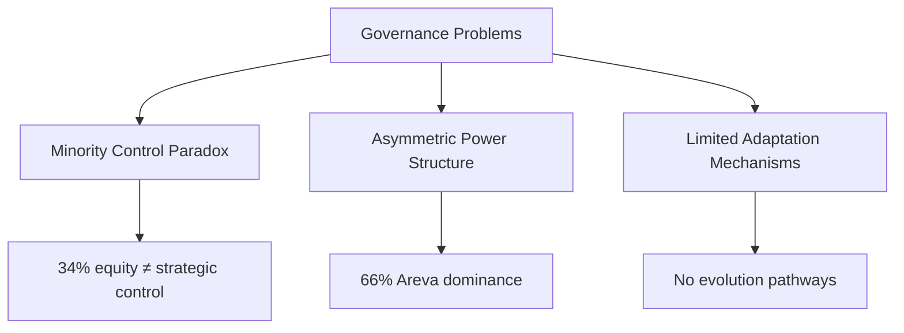

**Control-Ownership Misalignment**:
- **Siemens Position**: 34% equity with limited operational control
- **Decision Speed**: Areva's "slow decision-making" frustrated Siemens
- **Strategic Direction**: Minority position prevented strategic influence
- **Value Capture**: Limited access to profitable fuel/reprocessing segments

#### **Contract Design Deficiencies (Chapter 5)**

**Missing Adaptation Provisions**:
- **No Staged Evolution**: No mechanisms for increasing Siemens' stake
- **Rigid Structure**: 34-66% split set in stone
- **Limited Scope**: Reactor focus only, no value chain expansion
- **One-Way Option**: Only Areva buyout right, no Siemens expansion option

### **3. Environmental Misalignment**

#### **Market Environment Evolution**

**Nuclear Industry Transformation (2001-2009)**:
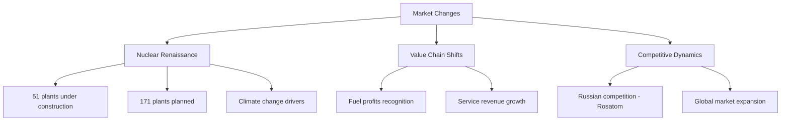

**Strategic Implications**:
- **Market Opportunity**: Nuclear renaissance created growth potential
- **Value Recognition**: Fuel/reprocessing profitability became apparent
- **Competitive Pressure**: New players (Rosatom) entering market
- **Geographic Expansion**: Global opportunities emerging

#### **Political Environment Constraints**

**Franco-German Political Dynamics**:
- **French Position**: Nuclear strategic asset protection
- **German Policy**: Domestic nuclear phase-out continuation
- **Sarkozy Declaration**: Explicit opposition to increased German control
- **Strategic Asset Protection**: Areva's 80% state ownership barrier

**Political-Business Tension**:
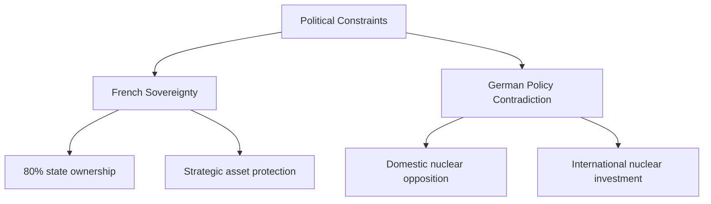

### **4. Alliance Mindset Failures (Chapter 24)**

#### **Tension Management Inadequacy**

**Cooperative vs. Competitive Tensions**:
- **Initial Cooperation**: Successful joint venture operation
- **Emerging Competition**: Siemens developing alternative partnerships (Rosatom)
- **Trust Erosion**: Secret negotiations while maintaining operational cooperation

**Control vs. Flexibility Tensions**:
- **Areva's Control**: Maintaining dominant position and decision authority
- **Siemens' Flexibility**: Seeking adaptation and strategic repositioning
- **Structural Rigidity**: Alliance design preventing necessary evolution

#### **Communication and Relationship Breakdown**

**Email Divorce Announcement**:
- **Relationship Insensitivity**: Lauvergeon's "note on kitchen table" comparison
- **Trust Destruction**: Lack of collaborative exit discussion
- **Cultural Mismatch**: German directness vs. French relationship expectations

### **Co-Evolution Failure Analysis Matrix**

| Evolution Dimension | Siemens | Areva | Alliance Structure | Environment |
|---------------------|---------|-------|-------------------|-------------|
| **Strategic Objectives** | Exit → Growth | Maintain Leadership | Static | Nuclear Renaissance |
| **Control Preferences** | Increase | Maintain | Rigid 34-66% | Political Constraints |
| **Value Chain Scope** | Expand | Protect | Limited to Reactors | Full Chain Opportunities |
| **Partnership Approach** | Seek Alternatives | Maintain Status Quo | No Adaptation Mechanisms | Competitive Pressure |

### **Root Cause: Structural Determinism**

**Fundamental Design Flaw**: The alliance structure was designed for **divestment scenario** (Siemens exit strategy) but became **incompatible** with **growth scenario** (nuclear renaissance).

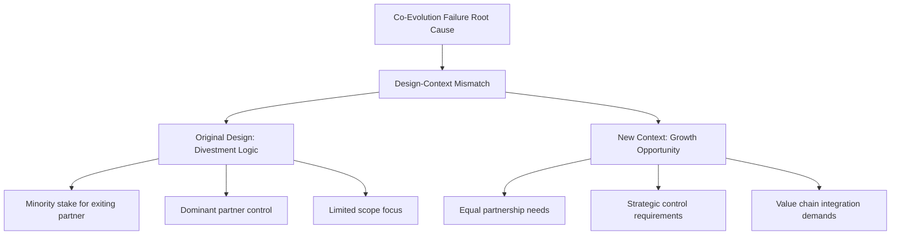

---

## **Question 2: Why was the end of the relationship so difficult?**

### **Alliance Termination Complexity Analysis (Chapter 9)**

The Areva-Siemens divorce exemplifies the most complex type of alliance termination: **asymmetric exit from successful partnership with high interdependence**.

### **1. Financial Complexity**

#### **Valuation and Payment Challenges**

**€4 Billion Buyout Burden**:
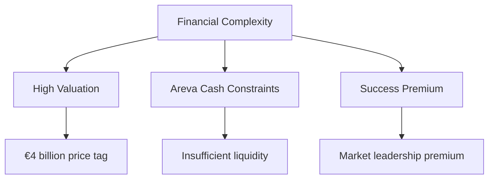

**Valuation Complications**:
- **Success Premium**: Alliance success increased share value
- **Market Timing**: Nuclear renaissance peak valuation
- **Future Potential**: Growth prospects reflected in price
- **Asset Integration**: Difficulty separating joint investments

**Areva's Financial Constraint**:
- **Limited Liquidity**: Insufficient cash for immediate buyout
- **State Ownership**: Limited financing options due to government ownership
- **Strategic Burden**: Major financial commitment for dominant partner

### **2. Operational Interdependence**

#### **Technology Integration Challenges**

**Software-Hardware Dependency**:
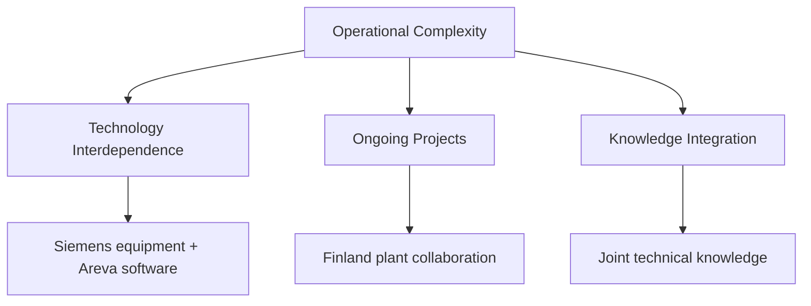

**Critical Dependencies**:
- **Equipment-Software Integration**: Siemens hardware requiring Areva software
- **Technical Knowledge**: Joint intellectual property and know-how
- **Operational Systems**: Integrated processes and procedures
- **Customer Relationships**: Joint client commitments and warranties

#### **Project Continuation Complications**

**Finland Nuclear Plant Example**:
- **Joint Liability**: €2 billion shared fine for delays
- **Ongoing Collaboration**: Continued cooperation despite termination
- **Reputation Risk**: Project failure would damage both partners
- **Technical Integration**: Inseparable technical contributions

### **3. Legal and Contractual Complexity**

#### **Non-Compete Clause Disputes**

**Original 8-Year Restriction**:
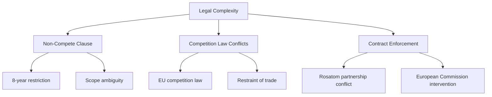

**Legal Battle Elements**:
- **Excessive Restriction**: 8-year non-compete deemed anti-competitive
- **European Law Conflict**: Restraint of trade vs. contract protection
- **Enforcement Challenge**: Difficulty monitoring compliance
- **Rosatom Complication**: New partnership while under restriction

#### **Contract Interpretation Disputes**

**Definitional Ambiguities**:
- **Scope of Restriction**: What constitutes "competing" activity
- **Geographic Coverage**: Global vs. regional restrictions
- **Technology Boundaries**: Which technologies covered by restrictions
- **Partnership Definitions**: What constitutes prohibited alliances

### **4. Strategic and Competitive Complexity**

#### **Market Position Protection**

**Areva's Competitive Concerns**:
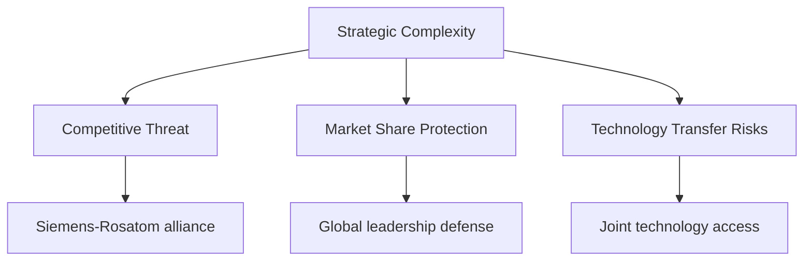

**Competitive Dynamics**:
- **Immediate Competition**: Siemens-Rosatom threatening market position
- **Technology Transfer**: Risk of proprietary knowledge flowing to competitors
- **Customer Relationships**: Potential client defection to new alliance
- **Market Credibility**: Reputation damage from partnership failure

#### **Betrayal Perception**

**Trust and Ethics Issues**:
- **Simultaneous Cooperation**: Continuing joint projects while planning exit
- **Secret Negotiations**: Rosatom discussions while still partners
- **Strategic Deception**: Using partnership to assess competitive opportunities
- **Relationship Violation**: "Act of betrayal" perception

### **5. Regulatory and Political Complexity**

#### **European Commission Intervention**

**Competition Policy Implications**:
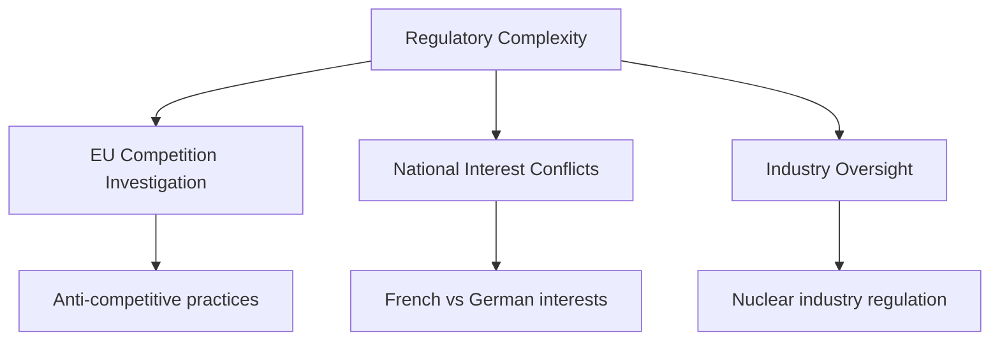

**Regulatory Challenges**:
- **Competition Law**: Non-compete clause legal validity
- **Market Dominance**: Preventing anti-competitive arrangements
- **Industrial Policy**: National strategic interests vs. EU competition policy
- **Precedent Setting**: Impact on future alliance terminations

#### **Franco-German Political Dimensions**

**International Relations Impact**:
- **Bilateral Relations**: Corporate dispute affecting government relations
- **Strategic Industries**: Nuclear energy political sensitivity
- **EU Integration**: Competition policy vs. national champions
- **Energy Security**: Strategic asset protection concerns

### **6. Termination Process Management Failures**

#### **Poor Termination Planning (Chapter 9)**

**Process Management Issues**:
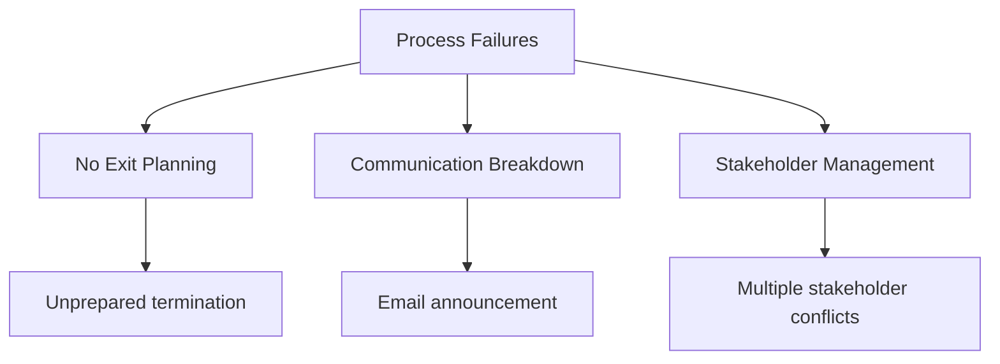

**Management Deficiencies**:
- **No Exit Strategy**: Alliance designed without termination planning
- **Communication Failure**: Inappropriate announcement method
- **Stakeholder Surprise**: Unprepared customers, employees, regulators
- **Value Destruction**: Contentious process destroying relationship value

#### **Relationship Management Breakdown**

**Trust and Respect Erosion**:
- **Cultural Insensitivity**: German efficiency vs. French relationship emphasis
- **Professional Discourtesy**: Email termination of 8-year partnership
- **Strategic Betrayal**: Simultaneous cooperation and competition
- **Public Relations**: Media conflict damaging both reputations

### **Termination Difficulty Analysis Framework**

| Complexity Dimension | Difficulty Level | Primary Factors |
|----------------------|------------------|-----------------|
| **Financial** | ⭐⭐⭐⭐⭐ High | €4B valuation, cash constraints |
| **Operational** | ⭐⭐⭐⭐⭐ High | Technology interdependence |
| **Legal** | ⭐⭐⭐⭐⭐ High | 8-year non-compete, EU law |
| **Strategic** | ⭐⭐⭐⭐⭐ High | Competitive threats, betrayal |
| **Regulatory** | ⭐⭐⭐⭐ Medium-High | EU competition investigation |
| **Political** | ⭐⭐⭐⭐ Medium-High | Franco-German relations |

---

## **Lessons for Alliance Management**

### **Co-Evolution Success Requirements**

#### **1. Adaptive Governance Design (Chapter 5)**
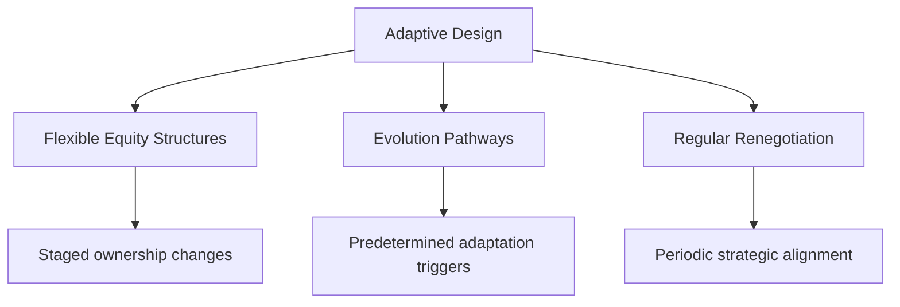

**Design Principles**:
- **Flexible Equity**: Staged ownership adjustment mechanisms
- **Evolution Triggers**: Predetermined conditions for structural changes
- **Scope Adaptation**: Ability to expand or contract alliance activities
- **Exit Options**: Multiple termination pathways with fair value mechanisms

#### **2. Continuous Alignment Management (Chapter 7)**

**Strategic Alignment Processes**:
- **Annual Strategy Reviews**: Regular assessment of strategic fit
- **Environmental Scanning**: Joint monitoring of market changes
- **Partner Evolution Tracking**: Understanding changing partner priorities
- **Early Warning Systems**: Detecting misalignment before crisis

#### **3. Termination Planning (Chapter 9)**

**Proactive Exit Management**:
- **Planned Dissolution**: Structured termination processes
- **Value Preservation**: Mechanisms to protect relationship value
- **Stakeholder Management**: Communication and transition planning
- **Asset Separation**: Clear procedures for disentangling operations

### **Key Takeaways**

1. **Co-evolution requires structural flexibility**: Rigid alliance designs cannot adapt to changing circumstances
2. **Success can create termination complexity**: Successful partnerships are harder to dissolve
3. **Political dimensions matter**: National interests can override commercial logic
4. **Termination process quality affects outcomes**: How alliances end impacts all stakeholders
5. **Trust preservation is valuable**: Maintaining relationships through termination enables future collaboration

### **Strategic Implications**

The Areva-Siemens case demonstrates that alliance success depends not just on initial design and ongoing management, but also on the ability to **evolve with changing circumstances** and **terminate gracefully when necessary**. Modern alliance managers must build **adaptive capacity** and **exit planning** into their alliance strategies from the outset.

**Alliance management is not just about creating and maintaining partnerships—it's about creating value throughout the entire alliance lifecycle, including thoughtful and respectful termination when strategic paths diverge.**

---

## **Case Study Questions**

### **Discussion Questions**

1. **Strategic Evolution**: How should alliance partners design structures that can accommodate dramatic strategic shifts like Siemens experienced?

2. **Political Risk Management**: What mechanisms could have been implemented to manage the Franco-German political tensions affecting the alliance?

3. **Termination Ethics**: Was Siemens' approach to exiting the alliance ethically appropriate, and how should partners balance strategic needs with relationship respect?

4. **Value Preservation**: How could both partners have preserved more value during the termination process?

5. **Learning Application**: What lessons from this case apply to other industry contexts and alliance types?

### **Analytical Exercises**

1. **Alternative Design**: Redesign the original alliance structure to better accommodate potential strategic evolution
2. **Exit Planning**: Develop a comprehensive termination plan that could have been included in the original alliance agreement
3. **Political Risk Assessment**: Create a political risk management framework for cross-border strategic alliances
4. **Communication Strategy**: Design a more appropriate termination communication and stakeholder management process

---

## **References and Further Reading**

### **Primary Sources**
- L'Expansion, June 6, 2010, and April 1, 2009
- Financial Times, April 28, 2009

### **Theoretical Applications**
- Chapter 5: Alliance Design and Governance Forms
- Chapter 7: Alliance Management and Relationship Building
- Chapter 9: Alliance Termination and Exit Strategies
- Chapter 24: Alliance Mindset and Tension Management
- Chapter 25: Alliance System and Co-Evolution

### **Related Cases**
- Other technology alliance terminations
- Cross-border partnership challenges
- Political risk in strategic alliances
- Joint venture dissolution processes