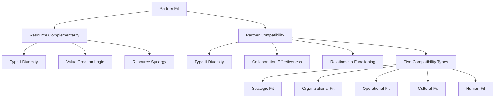
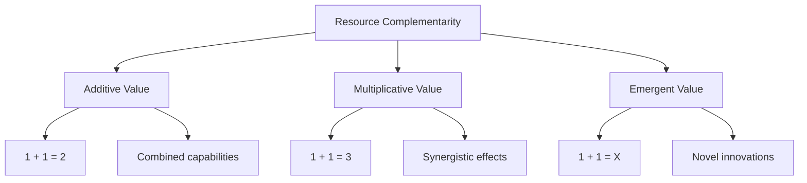
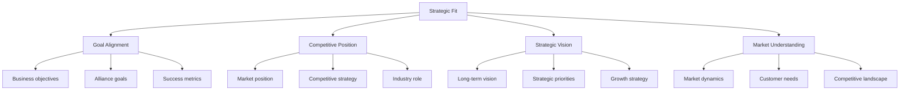
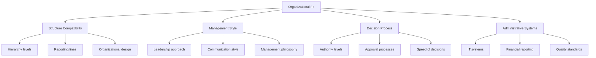
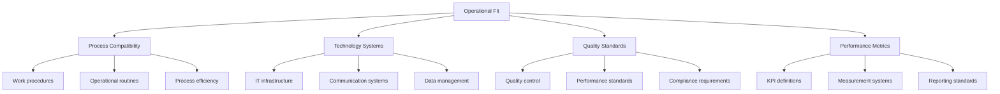
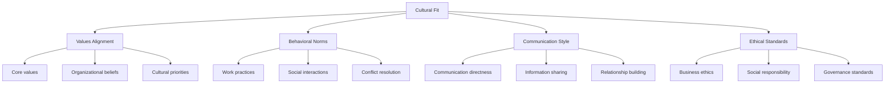
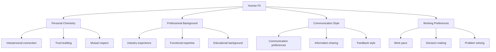
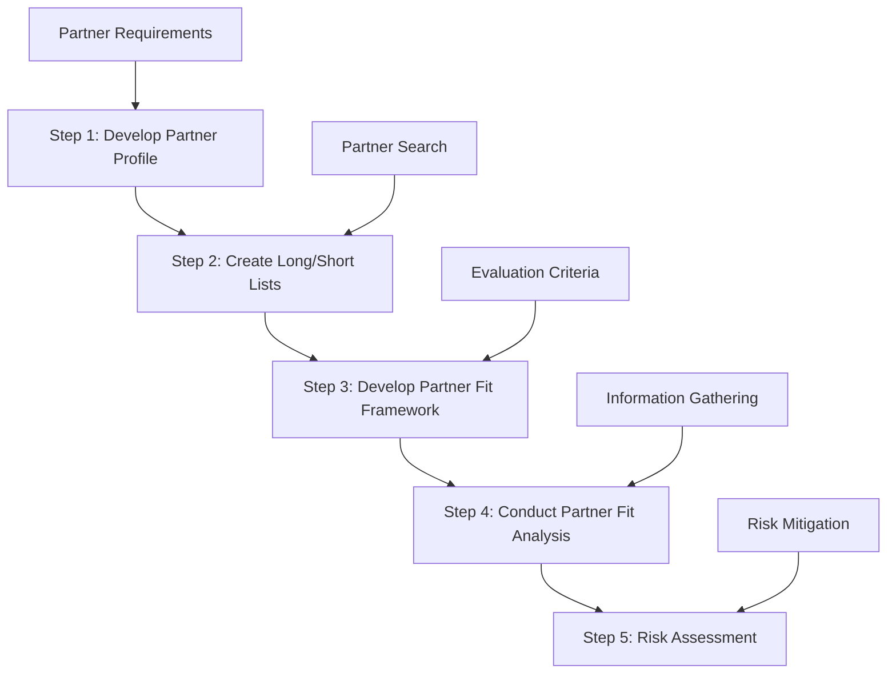
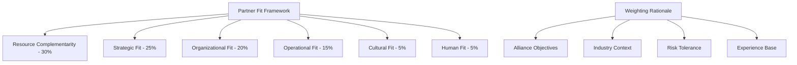
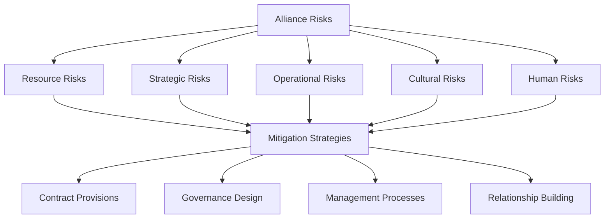

# Chapter 3: Alliance Partner Selection
## Partner Fit Assessment and Systematic Selection Processes

---

## Learning Objectives

By the end of this chapter, students will be able to:

1. **Differentiate** between resource complementarity and partner compatibility concepts
2. **Analyze** five types of partner fit: strategic, organizational, operational, cultural, and human
3. **Apply** the five-step partner selection decision-making framework
4. **Evaluate** partner fit through systematic assessment criteria
5. **Synthesize** risk assessment and corrective measures for partner misfit
6. **Design** comprehensive partner profiles and selection strategies

---

## 3.1 Conceptual Foundation: Types of Partner Fit

### Partner Fit Framework Overview



### Theoretical Distinction

**Two Fundamental Concepts**:
1. **Resource Complementarity** (Type I Diversity) - *Rationale for alliance formation*
2. **Partner Compatibility** (Type II Diversity) - *Enabler of alliance effectiveness*

---

## 3.2 Resource Complementarity

### Definition and Strategic Logic

> **Resource Complementarity**: The extent to which the joint use of distinct sets of resources yields a higher total return than the sum of returns earned if each set of resources were used independently.

**Mathematical Representation**:
```
Synergy = R(A+B) > R(A) + R(B)
Where: R = Return, A = Partner A Resources, B = Partner B Resources
```

### Value Creation Mechanisms



### Resource Complementarity Types

#### 1. Market-Based Complementarity
- **Geographic Expansion**: Local market knowledge + global capabilities
- **Customer Access**: Distribution channels + product offerings
- **Market Segments**: Different customer bases and expertise

#### 2. Technology-Based Complementarity
- **R&D Capabilities**: Basic research + applied development
- **Technical Expertise**: Hardware + software competencies
- **Innovation Assets**: Patents + commercialization abilities

#### 3. Operational Complementarity
- **Manufacturing**: Production capacity + efficiency expertise
- **Supply Chain**: Procurement power + logistics capabilities
- **Quality Systems**: Standards + implementation expertise

#### 4. Financial Complementarity
- **Capital Resources**: Investment funds + revenue streams
- **Risk Profile**: Stable cash flows + growth investments
- **Financial Expertise**: Capital markets + operational finance

### Complementarity Assessment Framework

| Resource Type | Partner A Strength | Partner B Strength | Synergy Potential |
|---------------|-------------------|-------------------|-------------------|
| Market Access | Emerging markets | Developed markets | Global coverage |
| Technology | Basic research | Applied R&D | Innovation pipeline |
| Operations | Manufacturing | Distribution | End-to-end value chain |
| Finance | Capital | Cash flow | Investment capacity |
| Brand | Recognition | Trust | Market credibility |

### Strategic Implications

#### Value Creation Benefits
- **Enhanced Competitive Position**: Combined resources create stronger market position
- **Innovation Acceleration**: Knowledge combination drives innovation
- **Cost Efficiency**: Resource sharing reduces individual investment requirements
- **Risk Mitigation**: Diversified resource base reduces dependencies

#### Potential Risks
- **Involuntary Knowledge Transfer**: Learning races and spillover effects
- **Competitive Positioning Threats**: Partner may become competitor
- **Resource Dependency**: Over-reliance on partner resources
- **Integration Complexity**: Difficulty in combining different resource systems

---

## 3.3 Partner Compatibility: Five Fit Types

### 3.3.1 Strategic Fit

#### Definition and Components
**Strategic Fit**: Compatibility in business and alliance goals, competitive positions, strategic missions, and market understanding.



#### Assessment Criteria
- **Business Rationale Alignment**: Shared understanding of alliance value proposition
- **Competitive Positioning**: Non-threatening competitive relationship
- **Strategic Priority**: Alliance importance in respective strategies
- **Time Horizon**: Compatible planning and investment timeframes
- **Market Perspective**: Shared views on industry evolution

#### Strategic Misfit Indicators
- Competitive behavior in alliance focus areas
- Conflicting strategic priorities
- Different market assessments
- Incompatible success definitions
- Divergent risk tolerance

### 3.3.2 Organizational Fit

#### Definition and Components
**Organizational Fit**: Compatibility in organizational structures, management styles, decision-making processes, and administrative systems.



#### Key Dimensions
- **Organizational Size**: Scale compatibility and resource proportionality
- **Structural Complexity**: Hierarchy levels and decision layers
- **Management Philosophy**: Centralized vs. decentralized approaches
- **Communication Patterns**: Formal vs. informal communication styles
- **Change Orientation**: Adaptability and flexibility preferences

#### Organizational Misfit Management
- **Alliance Design Simplification**: Limited scope and clear task division
- **Flexibility Mechanisms**: Contingency clauses and adaptation processes
- **Relationship Building**: Proactive management and regular communication
- **Integration Support**: Dedicated alliance management resources

### 3.3.3 Operational Fit

#### Definition and Components
**Operational Fit**: Compatibility in procedural capabilities, operational standards, working procedures, and business processes.



#### Assessment Areas
- **Technology Integration**: System compatibility and data exchange
- **Process Alignment**: Work flow synchronization and efficiency
- **Quality Systems**: Standards alignment and certification compatibility
- **Performance Management**: Metrics alignment and monitoring systems
- **Operational Flexibility**: Adaptation capability and responsiveness

#### Operational Integration Benefits
- **Coordination Efficiency**: Reduced transaction and communication costs
- **Process Optimization**: Combined operational excellence
- **Technology Synergy**: Integrated systems and data sharing
- **Quality Enhancement**: Combined quality standards and best practices

### 3.3.4 Cultural Fit

#### Definition and Components
**Cultural Fit**: Compatibility in organizational cultures, values, beliefs, and behavioral norms.



#### Cultural Dimensions
- **Power Distance**: Hierarchy and authority acceptance
- **Individualism vs. Collectivism**: Team vs. individual orientation
- **Uncertainty Avoidance**: Risk tolerance and ambiguity acceptance
- **Time Orientation**: Short-term vs. long-term perspective
- **Relationship vs. Task Focus**: Relationship building priority

#### Cultural Integration Strategies
- **Cultural Coexistence**: Maintain separate cultures with interface protocols
- **Cultural Assimilation**: Blend positive elements into new culture
- **Cultural Awareness**: Training and education programs
- **Cultural Bridging**: Cross-cultural teams and liaison roles

### 3.3.5 Human Fit

#### Definition and Components
**Human Fit**: Compatibility in individual backgrounds, experiences, personalities, and interpersonal dynamics.



#### Key Elements
- **Personal Chemistry**: Individual compatibility and interpersonal dynamics
- **Professional Compatibility**: Experience and expertise alignment
- **Communication Style**: Information sharing and interaction preferences
- **Trust Development**: Relationship building and credibility establishment
- **Collaborative Capability**: Teamwork and joint problem-solving skills

#### Human Fit Enhancement
- **Team Selection**: Careful assignment of alliance team members
- **Relationship Building**: Structured interaction and bonding activities
- **Communication Training**: Cross-cultural and interpersonal skills development
- **Conflict Resolution**: Structured approaches to managing disagreements

---

## 3.4 Alliance Partner Selection: Five-Step Framework

### Decision-Making Process Overview



### Step 1: Develop Partner Profile

#### Objectives
- **Ideal Partner Definition**: Specify desired partner characteristics
- **Requirement Clarification**: Detail resource and capability needs
- **Selection Criteria**: Establish evaluation and decision criteria

#### Partner Profile Components

**Resource Requirements**:
- **Financial Resources**: Capital capacity, investment ability, revenue stability
- **Technical Resources**: R&D capabilities, technology assets, innovation capacity
- **Market Resources**: Customer access, distribution channels, market knowledge
- **Operational Resources**: Manufacturing capacity, supply chain, quality systems

**Organizational Characteristics**:
- **Size and Scale**: Revenue, employees, market position, resource capacity
- **Structure**: Organizational design, decision-making processes, flexibility
- **Reputation**: Market standing, alliance experience, stakeholder trust
- **Strategic Position**: Competitive position, growth trajectory, industry role

**Cultural and Human Factors**:
- **Cultural Values**: Organizational culture, ethical standards, social responsibility
- **Management Style**: Leadership approach, communication patterns, decision speed
- **Human Capital**: Expertise, experience, educational background, skills
- **Relationship Orientation**: Collaboration history, partnership experience

#### Profile Development Process
1. **Alliance Strategy Review**: Link partner requirements to strategic objectives
2. **Stakeholder Input**: Gather requirements from alliance team and leadership
3. **Benchmarking**: Analyze successful partnership characteristics
4. **Prioritization**: Rank requirements by importance and criticality

### Step 2: Create Long and Short Lists

#### Long List Development
**Objective**: Comprehensive identification of potential partners

**Search Sources**:
- **Industry Networks**: Trade associations, professional organizations
- **Market Intelligence**: Industry databases, analyst reports
- **Digital Platforms**: LinkedIn, company websites, industry portals
- **Referral Networks**: Existing partners, consultants, intermediaries
- **Conference Networks**: Industry events, trade shows, academic conferences

**Long List Benefits**:
- **Comprehensive Coverage**: Reduces risk of missing optimal partners
- **Bargaining Power**: Multiple alternatives strengthen negotiation position
- **Market Understanding**: Broader industry and competitive intelligence

#### Short List Creation
**Objective**: Focused evaluation of highest-potential partners

**Screening Criteria**:
- **Strategic Alignment**: Basic fit with alliance objectives
- **Resource Availability**: Capability to contribute required resources
- **Partnership Readiness**: Interest and capacity for alliance engagement
- **Relationship History**: Previous partnership experience and outcomes

**Short List Characteristics**:
- **Manageable Size**: 3-7 potential partners for detailed analysis
- **Information Depth**: Sufficient detail for comprehensive evaluation
- **Decision Support**: Clear rationale for inclusion and exclusion

### Step 3: Develop Partner Fit Framework

#### Framework Structure
**Objective**: Systematic evaluation methodology with weighted criteria



#### Weighting Methodology
**Context-Dependent Priorities**:
- **Technology Alliances**: Higher weight on resource complementarity and operational fit
- **International Alliances**: Higher weight on cultural and human fit
- **Learning Alliances**: Higher weight on strategic and organizational fit
- **Operational Alliances**: Higher weight on operational and organizational fit

#### Evaluation Scales
- **Quantitative Measures**: Financial metrics, performance indicators
- **Qualitative Assessments**: Cultural compatibility, relationship quality
- **Binary Decisions**: Compliance requirements, ethical standards
- **Comparative Rankings**: Relative position among alternatives

### Step 4: Conduct Partner Fit Analysis

#### Information Gathering Strategy

**Internal Sources**:
- **Existing Knowledge**: Previous interactions, market intelligence
- **Network Intelligence**: Referrals, recommendations, references
- **Public Information**: Annual reports, websites, news coverage
- **Industry Data**: Market research, competitive analysis

**External Sources**:
- **Due Diligence**: Financial, legal, operational assessment
- **Reference Checks**: Customer, supplier, partner feedback
- **Management Meetings**: Exploratory discussions and presentations
- **Site Visits**: Operational facility tours and assessments

#### Analysis Methodology

**Scoring System Example**:
| Criteria | Weight | Partner A Score | Partner B Score | Partner C Score |
|----------|--------|----------------|----------------|----------------|
| Resource Complementarity | 30% | 8/10 (2.4) | 7/10 (2.1) | 9/10 (2.7) |
| Strategic Fit | 25% | 9/10 (2.25) | 8/10 (2.0) | 7/10 (1.75) |
| Organizational Fit | 20% | 6/10 (1.2) | 9/10 (1.8) | 8/10 (1.6) |
| Operational Fit | 15% | 7/10 (1.05) | 8/10 (1.2) | 8/10 (1.2) |
| Cultural Fit | 5% | 8/10 (0.4) | 6/10 (0.3) | 9/10 (0.45) |
| Human Fit | 5% | 9/10 (0.45) | 7/10 (0.35) | 8/10 (0.4) |
| **Total Score** | 100% | **7.75** | **7.75** | **8.1** |

#### Information Verification
- **Cross-Reference Checking**: Multiple source validation
- **Stakeholder Interviews**: Different perspectives and insights
- **Document Review**: Official records and financial statements
- **Performance Benchmarking**: Industry comparison and standards

### Step 5: Risk Assessment

#### Risk Categories and Mitigation



#### Risk Assessment Framework

**Resource Risks**:
- **Non-performing Resources**: Partner inability to deliver expected contributions
- **Resource Substitution**: Partner provides alternative but less valuable resources
- **Resource Access**: Restrictions or limitations on resource utilization
- **Resource Quality**: Performance below expected standards

**Strategic Risks**:
- **Goal Misalignment**: Evolving objectives creating conflicts
- **Competitive Threats**: Partner becoming competitor in core areas
- **Strategic Priority**: Alliance losing importance in partner strategy
- **Market Changes**: Environmental shifts affecting alliance rationale

**Operational Risks**:
- **System Integration**: Technology and process compatibility challenges
- **Performance Standards**: Different quality and efficiency expectations
- **Coordination Costs**: Higher than anticipated management overhead
- **Scalability**: Inability to expand operations effectively

**Cultural and Human Risks**:
- **Cultural Conflicts**: Value and behavior misalignments
- **Communication Barriers**: Language and style differences
- **Relationship Breakdown**: Personal conflicts affecting collaboration
- **Trust Erosion**: Declining confidence and cooperation

#### Risk Mitigation Strategies

**Contractual Protection**:
- **Performance Guarantees**: Specific resource and outcome commitments
- **Termination Clauses**: Exit options for non-performance
- **Dispute Resolution**: Structured conflict management processes
- **Intellectual Property**: Protection and sharing agreements

**Governance Design**:
- **Alliance Structure**: Appropriate governance form selection
- **Control Mechanisms**: Monitoring and oversight systems
- **Decision Rights**: Clear authority and responsibility allocation
- **Flexibility Provisions**: Adaptation and change management

**Management Processes**:
- **Integration Planning**: Systematic combination of operations
- **Communication Systems**: Regular information exchange protocols
- **Performance Monitoring**: Continuous assessment and feedback
- **Relationship Management**: Trust building and maintenance

---

## 3.5 Case Study Analysis: SolarDuck Partnership Strategy

### Background: Offshore Floating Solar Innovation

**SolarDuck Overview**:
- **Industry**: Renewable energy (offshore floating solar)
- **Founded**: Recent startup with innovative technology
- **Business Model**: Technology integrator and global scaling
- **Challenge**: Rapid market expansion with limited internal resources

### Strategic Context: Energy Transition

**Market Drivers**:
- **Paris Agreement**: Global climate change commitments
- **Energy Decarbonization**: Shift from fossil fuels to renewables
- **Technology Advancement**: Improved efficiency and cost reduction
- **Policy Support**: Government incentives and targets

**Industry Characteristics**:
- **High Technology Intensity**: Continuous innovation requirements
- **Global Market**: Worldwide deployment opportunities
- **Complex Value Chain**: Multiple specialized components and services
- **Regulatory Environment**: Environmental and safety compliance

### Partner Selection Strategy

#### Partnership Rationale
**Why Alliance-focused Strategy?**
- **Resource Constraints**: Limited financial and operational capacity
- **Technology Specialization**: Focus on core technology integration
- **Global Reach**: Rapid international market expansion
- **Risk Mitigation**: Shared investment and market risks

#### Partner Profile Requirements

**Operational Partners**:
- **Specialized Competencies**: Component manufacturing and assembly
- **Geographic Presence**: Local market knowledge and access
- **Quality Standards**: High-tech manufacturing capabilities
- **Scalability**: Ability to expand production rapidly

**Strategic Partners**:
- **Market Access**: Distribution channels and customer relationships
- **Financial Capacity**: Investment and project financing ability
- **Industry Experience**: Renewable energy expertise
- **Entrepreneurial Spirit**: Willingness to develop new markets

### Specific Partnership Examples

#### Pondera Partnership (Netherlands/Southeast Asia)
**Partner Profile**:
- **Experience**: 2007 founding, established track record
- **Geographic Focus**: Netherlands and Southeast Asia
- **Role**: Project development and market access
- **Fit Assessment**: Strong local knowledge and regulatory expertise

**Strategic Fit Analysis**:
- **Goal Alignment**: Renewable energy development focus
- **Market Complementarity**: SolarDuck technology + Pondera development
- **Geographic Synergy**: Target market coverage
- **Risk Sharing**: Combined development and technology risks

### Fit Assessment Framework Application

#### Resource Complementarity
- **Technology Integration**: SolarDuck innovation + partner manufacturing
- **Market Access**: Local knowledge + global technology
- **Financial Resources**: Shared investment and project financing
- **Operational Capabilities**: Technology + development execution

#### Partner Compatibility
- **Strategic Fit**: Shared renewable energy vision
- **Operational Fit**: Compatible project development processes
- **Cultural Fit**: Entrepreneurial and innovation orientation
- **Human Fit**: Personal connections and trust building

### Risk Assessment and Mitigation

#### Key Risks
- **Technology Risk**: Unproven technology in new market
- **Market Risk**: Uncertain demand and regulatory changes
- **Partner Risk**: Dependence on partner capabilities
- **Competitive Risk**: Technology spillover and competition

#### Mitigation Strategies
- **Graduated Partnerships**: Incremental commitment and expansion
- **Multiple Partnerships**: Diversified partner portfolio
- **Intellectual Property Protection**: Technology safeguarding
- **Performance Monitoring**: Regular assessment and adjustment

---

## Discussion Questions

### Critical Analysis

1. **Fit Trade-offs**: How should organizations balance resource complementarity against partner compatibility when these create conflicting recommendations?

2. **Dynamic Fit**: How does partner fit change over time, and what mechanisms should be in place to monitor and adjust for evolving fit?

3. **Cultural Context**: How do national and regional cultural differences affect partner fit assessment and management strategies?

4. **Digital Transformation**: How has digital technology changed partner search, evaluation, and fit assessment processes?

5. **Sustainability Integration**: How should environmental and social criteria be integrated into partner selection frameworks?

### Application Exercises

1. **Partner Profile Development**: Create a comprehensive partner profile for a hypothetical alliance in your industry of interest.

2. **Fit Assessment**: Apply the five-fit framework to evaluate a recent alliance announcement and predict potential challenges.

3. **Risk Mitigation**: Develop specific risk mitigation strategies for identified partner fit challenges.

---

## Key Takeaways

### Academic Insights
- **Dual Fit Concept**: Resource complementarity and partner compatibility serve different functions
- **Multi-dimensional Assessment**: Five fit types provide comprehensive evaluation framework
- **Systematic Process**: Five-step methodology improves partner selection quality
- **Risk-Based Approach**: Proactive risk assessment enables better alliance design

### Practical Implications
- **Due Diligence**: Thorough partner assessment reduces alliance failure risks
- **Weighted Framework**: Context-specific criteria weighting improves decisions
- **Relationship Building**: Human and cultural fit increasingly important
- **Continuous Assessment**: Partner fit requires ongoing monitoring and management

### Future Directions
- **AI-Enhanced Selection**: Technology-supported partner identification and assessment
- **Dynamic Fit Models**: Real-time partner compatibility monitoring
- **Ecosystem Perspective**: Multi-partner network selection considerations
- **Digital Relationship Building**: Virtual collaboration and trust development

---

**Next Chapter Preview**: Chapter 4 will examine alliance negotiation, focusing on negotiation behavior, valuation methods, and systematic negotiation processes.

---

## References and Further Reading

### Theoretical Foundations
- Chi, T. (1994). Trading in strategic resources: Necessary conditions, transaction cost problems, and choice of exchange structure
- Dyer, J. H., & Singh, H. (1998). The relational view: Cooperative strategy and sources of interorganizational competitive advantage
- Parkhe, A. (1991). Interfirm diversity, organizational learning, and longevity in global strategic alliances

### Contemporary Applications
- Technology partnership selection criteria
- Cross-cultural alliance management
- Sustainability-focused partner assessment
- Digital platform partnership strategies