# Chapter 5: Alliance Design
## Governance Forms, Contracts, and Control Mechanisms

---

## Learning Objectives

By the end of this chapter, students will be able to:

1. **Differentiate** between equity and non-equity governance forms and their implications
2. **Analyze** the theoretical foundations for governance form selection decisions
3. **Evaluate** alliance contract completeness and standardization trade-offs
4. **Design** comprehensive management control systems for alliances
5. **Synthesize** governance form, contracts, and control mechanisms for optimal alliance design
6. **Apply** the five-step alliance design decision-making framework

---

## 5.1 Introduction: The Critical Nature of Alliance Design

### Strategic Importance of Alliance Design

> **Alliance Design**: The selection of governance form, formulation of contractual provisions, and implementation of management control mechanisms that prescribe how and under what conditions the alliance will be executed.

Alliance design represents a **critical juncture** in the alliance development process because:
- **Performance Foundation**: Design choices fundamentally affect alliance outcomes
- **Risk Management**: Proper design mitigates exchange hazards and opportunistic behavior
- **Coordination Framework**: Design establishes the structure for ongoing collaboration
- **Adaptation Capability**: Design determines flexibility for future changes

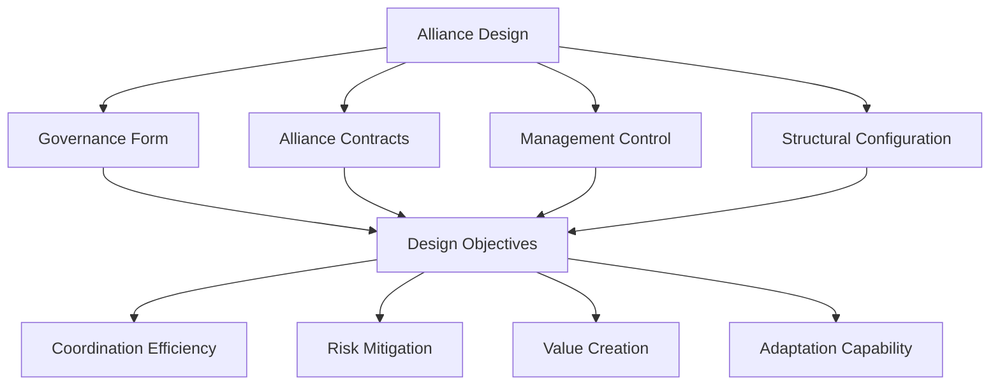

---

## 5.2 Governance Forms: Structural Foundation

### 5.2.1 Conceptual Framework

**Governance Form**: The configuration of structural building blocks that organize partners' coordination and contractual enforcement legally, aiming to minimize costs while ensuring necessary control.

#### Primary Objectives
1. **Interest Alignment**: Create incentive structures promoting long-term cooperation
2. **Exchange Hazard Reduction**: Protect against opportunistic behavior and benefit misappropriation
3. **Coordination Facilitation**: Enable efficient joint decision-making and implementation
4. **Cost Minimization**: Achieve control objectives with minimal governance costs

### 5.2.2 Exchange Hazards in Alliances

#### Types of Exchange Hazards

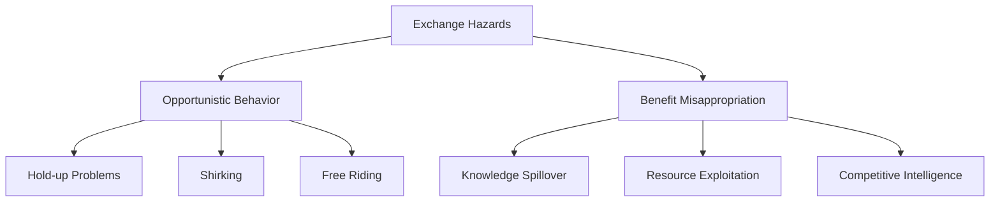

#### 1. Opportunistic Behavior

**Definition**: Self-interested behavior with guile, including deception, incomplete disclosure, and exploitation of partner vulnerabilities.

**Manifestations**:

**Hold-up Problems**:
- **Mechanism**: Exploitation of partner dependence on relationship-specific assets
- **Example**: Partner threatens to exit after specific investments are made
- **Impact**: Reduced willingness to make specialized investments

**Shirking**:
- **Mechanism**: Avoiding contracted obligations while appearing compliant
- **Example**: Reducing quality of resource contributions below agreed standards
- **Impact**: Asymmetric effort leading to suboptimal outcomes

**Free Riding**:
- **Mechanism**: Benefiting from partner efforts without reciprocal contribution
- **Example**: Gaining knowledge without sharing proprietary information
- **Impact**: Inequitable value distribution and relationship strain

#### 2. Benefit Misappropriation

**Knowledge Leakage**:
- Unintended transfer of proprietary knowledge and capabilities
- Competitive intelligence gathering beyond alliance scope
- Technology and process reverse engineering

**Resource Exploitation**:
- Using partner resources for non-alliance purposes
- Leveraging partner capabilities for competitive advantage
- Accessing partner networks and relationships inappropriately

### 5.2.3 Non-Equity vs. Equity Arrangements

#### Non-Equity Arrangements

**Definition**: Alliances based solely on contractual agreements without equity exchange or shared ownership.

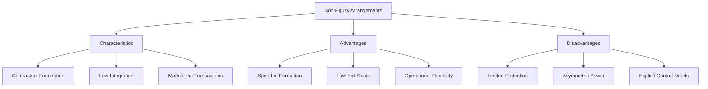

**Key Characteristics**:
- **Contractual Basis**: Reliance on detailed contracts for governance
- **Low Integration**: Minimal organizational coupling between partners
- **Market Mimicry**: Transactions similar to market exchanges
- **Dominant Partner**: Often one party leads the relationship

**Advantages**:
- **Formation Speed**: Quick establishment with minimal legal complexity
- **Exit Flexibility**: Low dissolution costs and minimal entanglement
- **Operational Autonomy**: Partners maintain independent operations
- **Cost Efficiency**: Lower governance and monitoring costs

**Disadvantages**:
- **Limited Protection**: Minimal safeguards against exchange hazards
- **Control Requirements**: Need for explicit and close monitoring
- **Power Asymmetry**: Potential for dominant partner exploitation
- **Relationship Fragility**: Susceptible to opportunistic behavior

**Typical Applications**:
- Production partnerships with clear specifications
- Marketing alliances with defined territories
- Technology licensing with explicit terms
- Supply relationships with standard products

#### Equity Arrangements

**Definition**: Alliances involving equity transfer or establishment of new organizational entities (joint ventures) with shared ownership.

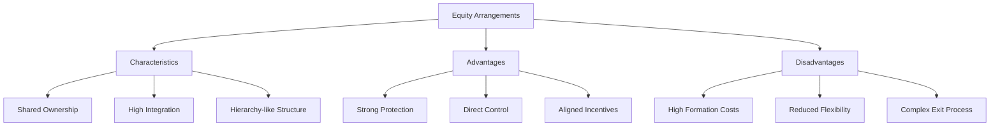

**Key Characteristics**:
- **Equity Participation**: Financial investment creating ownership stakes
- **High Integration**: Substantial organizational coupling
- **Shared Governance**: Joint decision-making and control mechanisms
- **Long-term Orientation**: Commitment through financial ties

**Advantages**:
- **Exchange Protection**: Equity stakes align interests and deter opportunism
- **Direct Control**: Ownership provides decision-making authority
- **Transparency**: Shared ownership enables better information access
- **Commitment Signal**: Financial investment demonstrates serious intent

**Disadvantages**:
- **Formation Complexity**: Expensive and time-consuming establishment
- **Reduced Flexibility**: Difficult and costly to modify or exit
- **Integration Costs**: Substantial coordination and management overhead
- **Bureaucratic Risk**: Potential for organizational inefficiency

**Typical Applications**:
- Joint ventures for major market entry
- R&D collaborations with shared IP
- Manufacturing partnerships with specialized assets
- Strategic alliances with long-term commitments

### 5.2.4 Governance Form Selection: Theoretical Perspectives

#### Transaction Cost Economics (TCE)

**Core Logic**: Governance forms should minimize transaction costs by matching exchange conditions.

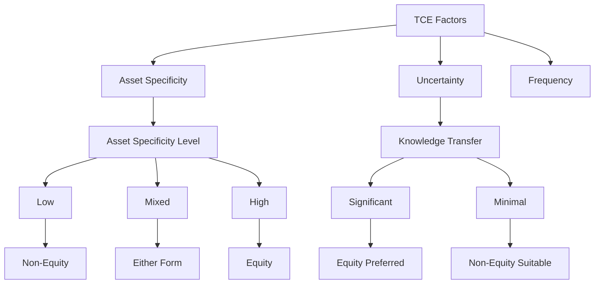

**Key Predictions**:
- **Asset Specificity**: Higher specificity favors equity arrangements
- **Knowledge Transfer**: Significant knowledge exchange requires equity governance
- **Appropriation Risk**: Equity participation deters opportunistic behavior
- **Monitoring Benefits**: Shared ownership improves oversight capabilities

**Empirical Support**: 
- Studies consistently support asset specificity predictions
- Knowledge-intensive alliances show preference for equity forms
- Opportunism concerns correlate with equity arrangement choice

#### Resource-Based View (RBV)

**Core Logic**: Governance forms should maximize value creation while protecting competitive advantages.

**Key Considerations**:
- **Resource Complementarity**: High complementarity may favor equity arrangements
- **Resource Imitation Risk**: Valuable, rare resources require protection
- **Learning Objectives**: Knowledge acquisition goals influence form choice
- **Competitive Position**: Protection of competitive advantages

**Governance Implications**:
- **Equity for Learning**: When knowledge acquisition is primary objective
- **Non-Equity for Access**: When resource access without integration suffices
- **Protection Mechanisms**: Higher protection needs favor equity arrangements

#### Resource Dependence Perspective (RDP)

**Core Logic**: Governance forms should reduce external dependencies and increase control over critical resources.

**Key Factors**:
- **Resource Criticality**: More critical resources favor equity arrangements
- **Alternative Availability**: Fewer alternatives increase equity preference
- **Interdependence Level**: Higher interdependence supports equity forms
- **Control Requirements**: Greater control needs favor equity arrangements

#### Social Network Theory (SNT)

**Core Logic**: Prior relationships and trust levels influence governance form preferences.

**Network Effects**:
- **Trust Development**: Higher trust reduces need for equity protection
- **Relationship History**: Positive prior experience enables non-equity forms
- **Network Position**: Central positions provide alternative governance options
- **Information Access**: Network connections reduce uncertainty and monitoring needs

### 5.2.5 Governance Form Decision Framework

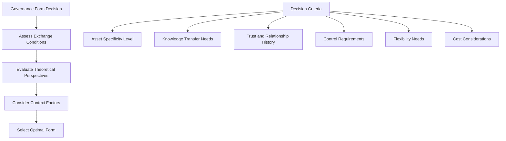

| Criteria | Non-Equity Preferred | Equity Preferred |
|----------|---------------------|------------------|
| Asset Specificity | Low | High |
| Knowledge Transfer | Minimal/Explicit | Significant/Tacit |
| Trust Level | High | Low-Medium |
| Control Needs | Limited | Substantial |
| Flexibility Priority | High | Medium-Low |
| Formation Speed | Critical | Less Important |
| Exit Complexity | Simple Preferred | Acceptable |
| Financial Commitment | Limited | Substantial |

---

## 5.3 Alliance Contracts: Legal Framework

### 5.3.1 Contract Functions and Objectives

**Alliance Contract**: A legally binding institutional framework that codifies rights, duties, responsibilities, and specifies goals, policies, and strategies underlying the anticipated cooperation.

#### Primary Functions

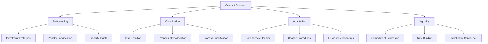

#### 1. Safeguarding Function
- **Investment Protection**: Safeguards against misappropriation of alliance-specific investments
- **Penalty Specification**: Defines consequences for contract violations
- **Property Rights**: Clarifies ownership and usage rights for shared resources

#### 2. Coordination Function
- **Task Definition**: Specifies individual and joint responsibilities
- **Process Documentation**: Outlines operational procedures and workflows
- **Decision Rights**: Allocates authority for different types of decisions

#### 3. Adaptation Function
- **Contingency Planning**: Addresses potential future scenarios and responses
- **Change Procedures**: Establishes mechanisms for contract modification
- **Flexibility Provisions**: Enables adaptation to unforeseen circumstances

#### 4. Signaling Function
- **Commitment Demonstration**: Tangible expression of partnership dedication
- **Trust Building**: Foundation for relationship development
- **Stakeholder Assurance**: Confidence building for external parties

### 5.3.2 Contract Completeness

**Contractual Completeness**: The degree to which contractual terms actually appear in an alliance contract, affecting alliance development and outcomes.

#### Completeness Continuum

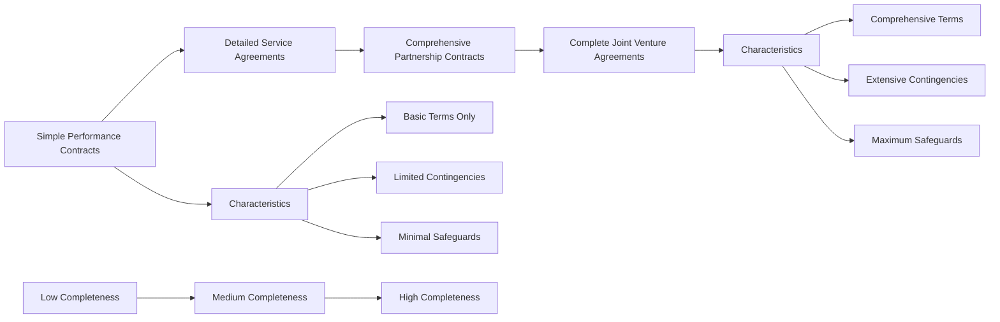

#### Factors Influencing Contract Completeness

**Risk Factors (Increase Completeness)**:
- **Opportunism Risk**: Higher perceived partner opportunism risk
- **Performance Ambiguity**: Difficulty in measuring and monitoring performance
- **Asset Specificity**: Relationship-specific investments requiring protection
- **Alliance Uncertainty**: Unpredictable environments and outcomes

**Relationship Factors (Decrease Completeness)**:
- **Trust Level**: Higher trust reduces need for detailed contracts
- **Prior Experience**: Positive relationship history enables simpler contracts
- **Relational Quality**: Strong relationships substitute for formal governance

**Environmental Factors**:
- **Legal System Quality**: Stronger legal systems reduce contract detail needs
- **Industry Norms**: Sector practices influence contract complexity
- **Competitive Intensity**: Higher competition increases protection needs

#### Contract Completeness Trade-offs

| **Benefits of High Completeness** | **Costs of High Completeness** |
|-----------------------------------|--------------------------------|
| Enhanced protection against opportunism | Increased negotiation time and costs |
| Clear performance expectations | Potential damage to initial trust |
| Reduced behavioral uncertainty | Reduced flexibility and adaptation |
| Better dispute resolution framework | Higher monitoring and enforcement costs |
| Stakeholder confidence | Complexity in relationship management |

### 5.3.3 Key Contractual Clauses

#### Essential Contract Elements

**Strategic and Operational Clauses**:
- **Alliance Objectives**: Business goals and success metrics
- **Scope Definition**: Product, geographic, technology, and time boundaries
- **Resource Contributions**: Partner inputs and responsibilities
- **Exclusivity Terms**: Market and competitive restrictions

**Financial and Legal Clauses**:
- **Financial Arrangements**: Investment, revenue sharing, cost allocation
- **Intellectual Property**: Ownership, usage rights, and protection
- **Liability and Risk**: Allocation of risks and liabilities
- **Dispute Resolution**: Conflict management and resolution procedures

**Operational and Management Clauses**:
- **Governance Structure**: Decision-making authority and processes
- **Performance Standards**: Quality, delivery, and service requirements
- **Communication Protocols**: Information sharing and coordination
- **Termination Provisions**: Exit conditions and procedures

#### Advanced Contract Provisions

**Adaptation Mechanisms**:
- **Contingency Clauses**: Pre-specified responses to defined scenarios
- **Renegotiation Triggers**: Conditions requiring contract review
- **Flexibility Provisions**: Authorized variations and modifications

**Protection Mechanisms**:
- **Non-disclosure Agreements**: Information protection requirements
- **Non-compete Clauses**: Competitive activity restrictions
- **Audit Rights**: Monitoring and verification procedures
- **Penalty Clauses**: Consequences for contract violations

### 5.3.4 Contract Standardization vs. Customization

#### Standardization Approach

**Benefits**:
- **Cost Efficiency**: Reduced negotiation and legal costs
- **Speed**: Faster contract development and execution
- **Learning Accumulation**: Knowledge building across contracts
- **Risk Reduction**: Proven terms and structures

**Applications**:
- Similar alliance types with comparable partners
- Routine transactions with standard requirements
- High-volume partnership programs
- Well-understood alliance contexts

#### Customization Approach

**Benefits**:
- **Context Fit**: Alignment with specific alliance requirements
- **Risk Management**: Tailored protection for unique risks
- **Relationship Building**: Collaborative contract development
- **Performance Optimization**: Specific performance requirements

**Applications**:
- Unique alliance structures or objectives
- High-risk or high-value partnerships
- Complex multi-partner arrangements
- Innovative or experimental collaborations

---

## 5.4 Management Control: Coordination and Influence

### 5.4.1 Control Mechanisms Overview

**Management Control**: Control mechanisms that alliance partners use beyond formal contracts to encourage coordination and ensure achievement of predetermined objectives.

#### Control Objectives

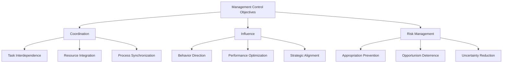

### 5.4.2 Three Control Modes

#### 1. Output Control

**Definition**: Control based on monitoring and evaluating outcomes and results rather than processes or behaviors.

**Characteristics**:
- **Results Focus**: Emphasis on achievements and deliverables
- **Objective Measurement**: Quantifiable performance indicators
- **Goal Alignment**: Clear outcome expectations and targets
- **Performance Incentives**: Rewards tied to result achievement

**Implementation Mechanisms**:
- **Performance Metrics**: KPIs and balanced scorecards
- **Milestone Reviews**: Regular progress assessments
- **Outcome Rewards**: Incentive systems based on results
- **Benchmarking**: Performance comparison standards

**Advantages**:
- Partner autonomy in process choices
- Clear accountability for results
- Efficient monitoring and evaluation
- Motivation through outcome incentives

**Limitations**:
- Difficulty in measuring complex outcomes
- Potential for gaming and manipulation
- Limited guidance on process improvement
- Risk of short-term focus

#### 2. Behavioral Control

**Definition**: Control through direct monitoring and specification of partner behaviors, processes, and activities.

**Characteristics**:
- **Process Focus**: Emphasis on how work is performed
- **Direct Monitoring**: Observation and oversight of activities
- **Standardization**: Prescribed procedures and methods
- **Compliance Emphasis**: Adherence to specified behaviors

**Implementation Mechanisms**:
- **Process Standards**: Detailed procedure specifications
- **Activity Monitoring**: Regular observation and reporting
- **Training Programs**: Skill and behavior development
- **Audit Systems**: Compliance verification procedures

**Advantages**:
- Direct influence over partner behavior
- Quality control through process management
- Knowledge transfer and capability building
- Risk reduction through standardization

**Limitations**:
- High monitoring costs and complexity
- Reduced partner autonomy and motivation
- Resistance to micromanagement
- Difficulty in specifying optimal behaviors

#### 3. Social Control

**Definition**: Control through shared values, trust, commitment, and informal coordination mechanisms.

**Characteristics**:
- **Relationship Focus**: Emphasis on trust and shared values
- **Informal Mechanisms**: Non-contractual coordination
- **Cultural Alignment**: Shared norms and beliefs
- **Mutual Commitment**: Joint dedication to success

**Implementation Mechanisms**:
- **Relationship Building**: Trust development activities
- **Cultural Integration**: Shared values and norms
- **Communication Systems**: Open information exchange
- **Joint Socialization**: Team building and interaction

**Advantages**:
- Lower monitoring and enforcement costs
- Enhanced cooperation and commitment
- Flexibility and adaptation capability
- Sustainable long-term relationships

**Limitations**:
- Time-intensive development process
- Cultural and personality dependencies
- Difficulty in measurement and evaluation
- Risk of relationship breakdown

### 5.4.3 Control Mode Selection

#### Contingency Factors

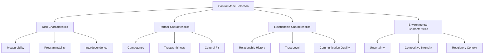

#### Decision Framework

| Factor | Output Control | Behavioral Control | Social Control |
|--------|---------------|-------------------|----------------|
| **Task Measurability** | High | Low-Medium | Any |
| **Task Programmability** | Low | High | Low-Medium |
| **Partner Competence** | High | Low-Medium | High |
| **Trust Level** | Medium | Low | High |
| **Cultural Similarity** | Any | Medium | High |
| **Relationship History** | Any | Limited | Extensive |
| **Environmental Uncertainty** | Low | Medium | High |
| **Alliance Complexity** | Low | Medium | High |

### 5.4.4 Control System Design

#### Integrated Control Approach

**Multi-Mode Systems**: Combining different control modes for comprehensive coverage and effectiveness.

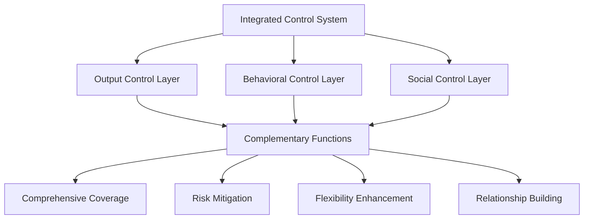

**Design Principles**:
- **Complementarity**: Different modes address different control needs
- **Balance**: Avoid over-reliance on single control mode
- **Evolution**: Control systems adapt as relationships mature
- **Efficiency**: Optimal cost-benefit ratio for control investments

#### Implementation Guidelines

**Phase-Based Implementation**:
1. **Initial Phase**: Emphasis on behavioral and output control
2. **Development Phase**: Gradual introduction of social control
3. **Mature Phase**: Social control dominance with monitoring backup

**Partner-Specific Adaptation**:
- **New Partners**: Higher formal control initially
- **Experienced Partners**: Greater reliance on social control
- **Cultural Distance**: Increased behavioral control needs
- **Competence Gaps**: Enhanced monitoring and training

---

## 5.5 Structural Configuration: Organizational Design

### 5.5.1 Alliance Structure Options

#### Organizational Architecture Choices

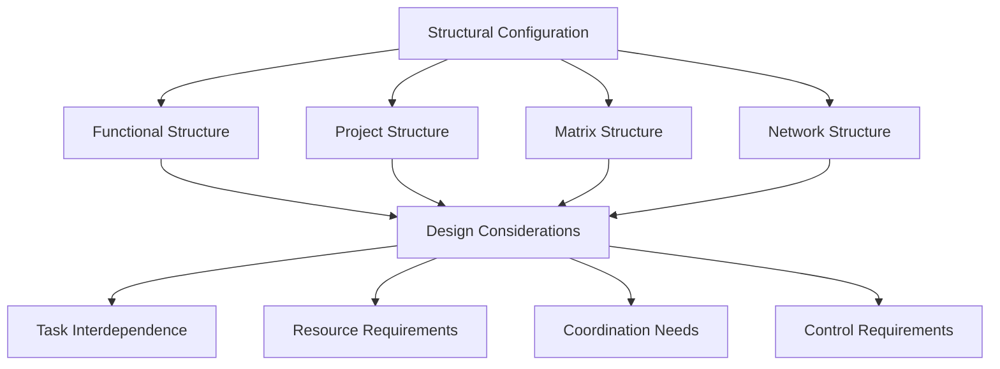

#### Structure Types and Applications

**Functional Structure**:
- **Application**: Specialized expertise requirements
- **Advantages**: Deep functional knowledge, clear accountability
- **Challenges**: Coordination complexity, potential silos

**Project Structure**:
- **Application**: Time-bound initiatives with clear deliverables
- **Advantages**: Focus, flexibility, rapid decision-making
- **Challenges**: Resource competition, limited permanence

**Matrix Structure**:
- **Application**: Complex projects requiring multiple competencies
- **Advantages**: Resource efficiency, knowledge sharing
- **Challenges**: Dual reporting, role ambiguity

**Network Structure**:
- **Application**: Multi-partner alliances and ecosystems
- **Advantages**: Flexibility, scalability, specialization
- **Challenges**: Coordination complexity, control difficulties

### 5.5.2 Interface Management

#### Boundary Spanning Mechanisms

**Key Positions and Roles**:
- **Alliance Managers**: Dedicated relationship coordinators
- **Liaison Officers**: Functional area representatives
- **Cross-functional Teams**: Joint problem-solving groups
- **Steering Committees**: Strategic oversight and direction

**Communication Systems**:
- **Formal Channels**: Regular meetings and reporting systems
- **Informal Networks**: Relationship building and information sharing
- **Technology Platforms**: Digital collaboration tools
- **Knowledge Management**: Information sharing and learning systems

---

## 5.6 Alliance Design: Five-Step Decision Framework

### Step-by-Step Design Process

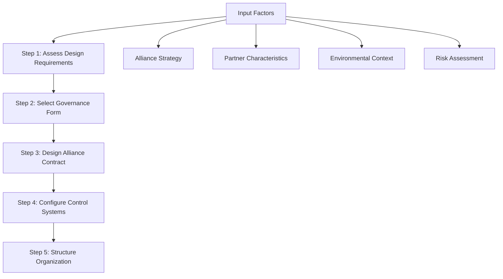

### Step 1: Assess Design Requirements

#### Requirement Analysis Framework

**Strategic Requirements**:
- Alliance objectives and success criteria
- Competitive positioning and value creation
- Timeline and performance expectations
- Stakeholder requirements and constraints

**Operational Requirements**:
- Resource integration and coordination needs
- Process alignment and standardization
- Quality and performance standards
- Technology and system requirements

**Risk Requirements**:
- Exchange hazard identification and assessment
- Protection and mitigation needs
- Monitoring and control requirements
- Adaptation and flexibility needs

### Step 2: Select Governance Form

#### Decision Criteria Application

**Primary Considerations**:
- Asset specificity and investment levels
- Knowledge transfer requirements
- Trust and relationship factors
- Control and influence needs
- Cost and complexity tolerance

**Form Selection Logic**:
- **Non-Equity**: Low asset specificity, high trust, limited control needs
- **Equity**: High asset specificity, significant knowledge transfer, control requirements

### Step 3: Design Alliance Contract

#### Contract Development Process

**Content Determination**:
- Essential clauses identification
- Risk-specific protections
- Coordination mechanisms
- Adaptation provisions

**Completeness Decisions**:
- Risk assessment and protection needs
- Relationship factors and trust levels
- Environmental uncertainty and complexity
- Cost-benefit analysis of detailed contracts

### Step 4: Configure Control Systems

#### Control System Architecture

**Multi-Modal Design**:
- Output control for measurable outcomes
- Behavioral control for process requirements
- Social control for relationship management

**Implementation Planning**:
- Control mechanism specification
- Monitoring and evaluation systems
- Feedback and adjustment processes
- Resource allocation for control activities

### Step 5: Structure Organization

#### Organizational Design Decisions

**Structure Selection**:
- Task and coordination requirements
- Resource and competency needs
- Timeline and flexibility requirements
- Partner preferences and constraints

**Interface Design**:
- Communication and coordination mechanisms
- Decision-making authority and processes
- Conflict resolution procedures
- Performance monitoring systems

---

## Discussion Questions

### Critical Analysis

1. **Design Trade-offs**: How should alliance managers balance the protection benefits of complex governance designs against the relationship costs of formalization?

2. **Dynamic Design**: How should alliance design evolve as relationships mature and trust develops between partners?

3. **Cultural Considerations**: How do national and organizational cultural differences affect optimal alliance design choices?

4. **Digital Transformation**: How has digital technology changed alliance design requirements and possibilities?

5. **Multi-Partner Complexity**: How should design principles be adapted for complex multi-partner alliance networks?

### Application Exercises

1. **Design Analysis**: Evaluate the governance design of a recent alliance announcement and identify potential improvements.

2. **Contract Development**: Design a comprehensive contract for a hypothetical technology alliance including key clauses and provisions.

3. **Control System Design**: Develop an integrated control system for a cross-cultural alliance with different partner capabilities.

---

## Key Takeaways

### Academic Insights
- **Design Criticality**: Alliance design fundamentally affects performance outcomes
- **Multi-Component Integration**: Governance form, contracts, and control must be aligned
- **Theoretical Grounding**: Multiple theories provide complementary design guidance
- **Context Dependency**: Optimal design varies with alliance and environmental characteristics

### Practical Implications
- **Systematic Approach**: Five-step framework improves design quality and consistency
- **Risk-Based Design**: Exchange hazard assessment drives protection requirements
- **Evolution Capability**: Design should enable adaptation and relationship development
- **Cost-Benefit Balance**: Design complexity must be justified by protection and coordination benefits

### Future Directions
- **Digital Governance**: Technology-enabled alliance management and monitoring
- **Ecosystem Design**: Multi-partner and platform alliance architectures
- **Agile Alliances**: Flexible and adaptive governance structures
- **AI-Enhanced Control**: Automated monitoring and coordination systems

---

**Next Chapter Preview**: Chapter 6 will examine alliance launch, focusing on implementation challenges, integration processes, and early-stage relationship building.

---

## References and Further Reading

### Theoretical Foundations
- Williamson, O. E. (1985). The economic institutions of capitalism
- Gulati, R., & Singh, H. (1998). The architecture of cooperation: Managing coordination costs and appropriation concerns in strategic alliances
- Dekker, H. C. (2004). Control of inter-organizational relationships: Evidence on appropriation concerns and coordination requirements

### Contemporary Applications
- Digital alliance governance frameworks
- Multi-partner collaboration structures
- Agile alliance design principles
- Platform ecosystem orchestration models